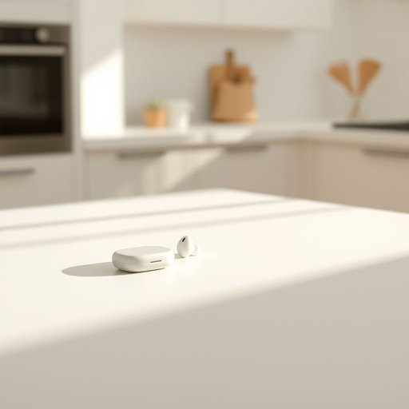

# earbud

<h1 style="font-size: 2.5em; font-weight: 300; letter-spacing: 2px; margin: 0; color: #2c3e50;">
/earbud*/
</h1>

---

---

## 例句

Although I usually prefer the comfort of over-ear headphones when I’m relaxing in the living room, I ended up grabbing a single earbud from the kitchen counter, where it had been left tangled next to the charger, just so I could quickly catch the last few minutes of my podcast without disturbing anyone else.

*Although(/ˌɔlˈðoʊ/) I(/aɪ/) usually(/ˈjuʒəwəli/) prefer(/prɪˈfər/) the(/ðə/) comfort(/ˈkəmfərt/) of(/əv/) over-ear(/over-ear*/) headphones(/ˈhɛdˌfoʊnz/) when(/wɪn/) I’m(/i’m*/) relaxing(/rɪˈlæksɪŋ/) in(/ɪn/) the(/ðə/) living(/ˈlɪvɪŋ/) room,(/rum,/) I(/aɪ/) ended(/ˈɛndɪd/) up(/əp/) grabbing(/ˈgræbɪŋ/) a(/ə/) single(/ˈsɪŋgəl/) earbud(/earbud*/) from(/frəm/) the(/ðə/) kitchen(/ˈkɪʧən/) counter,(/ˈkaʊntər,/) where(/wɛr/) it(/ɪt/) had(/hæd/) been(/bɪn/) left(/lɛft/) tangled(/ˈtæŋgəld/) next(/nɛkst/) to(/tɪ/) the(/ðə/) charger,(/ˈʧɑrʤər,/) just(/ʤɪst/) so(/soʊ/) I(/aɪ/) could(/kʊd/) quickly(/kˈwɪkli/) catch(/kæʧ/) the(/ðə/) last(/læst/) few(/fju/) minutes(/ˈmɪnəts/) of(/əv/) my(/maɪ/) podcast(/ˈpɔdˌkæst/) without(/wɪˈθaʊt/) disturbing(/dɪˈstərbɪŋ/) anyone(/ˈɛniˌwən/) else.(/ɛls./)*

**翻译：** 虽然我通常更喜欢在客厅放松时戴上包耳式耳机的舒适感，但这次我却从厨房的柜台上随手拿起了一只耳机，因为它和充电器一起缠在一起放着，我只是想快速听完播客的最后几分钟，而不打扰到其他人。

---

## 解释

“earbud”作为名词在家居生活用品的语境中指的是一种小型的耳机，通常直接放置于耳道入口处，用于听音乐、通话或其他音频播放，其特点是体积小巧、便携方便，常见于日常生活、通勤、健身等场合。英语学习者需要注意“earbud”一般用作可数名词，单数形式是“earbud”，复数形式是“earbuds”，在表达时常与动词“wear”、“use”或动词短语“put in”搭配，如“wear earbuds”、“use earbuds to listen to music”，此外，“earbud”通常特指入耳式耳机，与“over-ear headphones”（头戴式耳机）等区分开来。关于词源，“earbud”由“ear”（耳朵）和“bud”（芽、花蕾）构成，形象地指代像花蕾一样小巧的耳机部分，这一词汇起源于20世纪末耳机技术普及后，为区别传统头戴式耳机而产生。中文中“earbud”准确翻译为“入耳式耳机”或“耳塞式耳机”，应避免误译为“耳塞”（earplug，指阻隔噪音的耳塞）以免混淆。该词汇本身无褒贬色彩，属于中性词，在现代电子消费品领域普遍使用，没有特殊文化含义，但因其小巧便利，常与现代生活节奏快、移动性强的生活方式关联。

---

<small style="color: #999; font-size: 0.9em;">2025-07-17 06:22:39</small>

