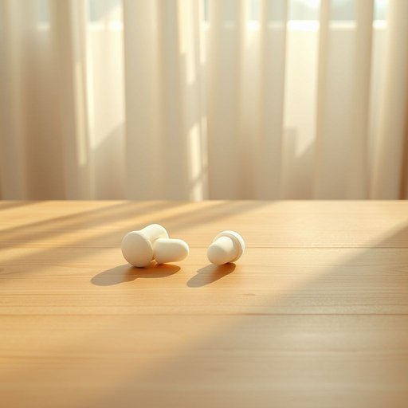

# earplug

<h1 style="font-size: 2.5em; font-weight: 300; letter-spacing: 2px; margin: 0; color: #2c3e50;">
/ˈɪrˌpləg/
</h1>

---

---

## 例句

Before I started the DIY project, which involved drilling into the old wooden floorboards and potentially disturbing the neighbours, I made sure to grab a pair of earplugs from the bathroom cabinet, as their sound-proofing ability is essential to protect my ears from the constant, high-pitched noise.

*Before(/ˌbiˈfɔr/) I(/aɪ/) started(/ˈstɑrtɪd/) the(/ðə/) DIY(/diy*/) project,(/ˈprɑʤɛkt,/) which(/wɪʧ/) involved(/ˌɪnˈvɑlvd/) drilling(/ˈdrɪlɪŋ/) into(/ˈɪntu/) the(/ðə/) old(/oʊld/) wooden(/ˈwʊdən/) floorboards(/ˈflɔrˌbɔrdz/) and(/ənd/) potentially(/pəˈtɛnʃəli/) disturbing(/dɪˈstərbɪŋ/) the(/ðə/) neighbours,(/ˈneɪbərz,/) I(/aɪ/) made(/meɪd/) sure(/ʃʊr/) to(/tɪ/) grab(/græb/) a(/ə/) pair(/pɛr/) of(/əv/) earplugs(/ˈɪrˌpləgz/) from(/frəm/) the(/ðə/) bathroom(/ˈbæθˌrum/) cabinet,(/ˈkæbənət,/) as(/ɛz/) their(/ðɛr/) sound-proofing(/sound-proofing*/) ability(/əˈbɪləˌti/) is(/ɪz/) essential(/ɛˈsɛnʃəl/) to(/tɪ/) protect(/prəˈtɛkt/) my(/maɪ/) ears(/ɪrz/) from(/frəm/) the(/ðə/) constant,(/ˈkɑnstənt,/) high-pitched(/high-pitched*/) noise.(/nɔɪz./)*

**翻译：** 在开始这个涉及钻孔旧木地板并可能打扰邻居的DIY项目之前，我特意从浴室的柜子里拿了一副耳塞，因为它们的隔音效果对于保护我的耳朵免受持续高频噪音的伤害至关重要。

---

## 解释

英语单词“earplug”作为名词，指的是一种小型的、通常由柔软材料如泡沫、硅胶或蜡制成的耳塞，旨在插入耳道以阻隔噪音或水分，常用于家居生活中帮助睡眠、隔绝环境噪声或洗澡时防止耳朵进水。这一词汇在描述个人防护用品、睡眠辅助工具或静音环境创建时较为常见。学习者在使用“earplug”时应注意其可数和不可数用法，通常复数形式为“earplugs”，且常与动词搭配，如“wear earplugs”（戴耳塞）、“insert earplugs”（插入耳塞），或与形容词搭配，如“foam earplugs”（泡沫耳塞）、“reusable earplugs”（可重复使用的耳塞）。词源上，“earplug”由“ear”（耳朵）和“plug”（塞子）合成，直观表达其功能和形态，起源于英语词汇合成规律，无特殊隐喻或文化内涵，在英美等国家广泛使用且中性，既没有明显褒义也无贬义。中文中“earplug”准确翻译为“耳塞”，强调其作为阻隔噪音或水分的家居生活用品的功能，使用时需根据具体语境选择单数“耳塞”或复数“耳塞”，该词在中文里同样为中性词汇，指代实用物品，无特别的文化褒义或贬义色彩。

---

<small style="color: #999; font-size: 0.9em;">2025-07-17 06:22:39</small>

