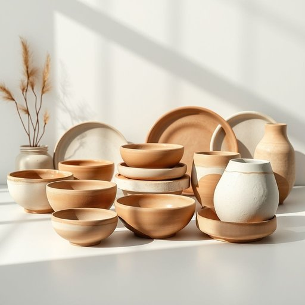

# earthenware

<h1 style="font-size: 2.5em; font-weight: 300; letter-spacing: 2px; margin: 0; color: #2c3e50;">
/ˈərθənˌwɛr/
</h1>

---

---

## 例句

During the conference, the clarity of his explanation regarding the concept of inertia helped the audience grasp the complex physics principles being discussed.

*During(/ˈdʊrɪŋ/) the(/ðə/) conference,(/ˈkɑnfərəns,/) the(/ðə/) clarity(/ˈklɛrɪti/) of(/əv/) his(/hɪz/) explanation(/ˌɛkspləˈneɪʃən/) regarding(/rɪˈgɑrdɪŋ/) the(/ðə/) concept(/ˈkɑnsɛpt/) of(/əv/) inertia(/ˌɪˈnərʃə/) helped(/hɛlpt/) the(/ðə/) audience(/ˈɔdiəns/) grasp(/græsp/) the(/ðə/) complex(/ˈkɑmplɛks/) physics(/ˈfɪzɪks/) principles(/ˈprɪnsəpəlz/) being(/biɪŋ/) discussed.(/dɪˈskəst./)*

**翻译：** 在会议期间，他对惯性概念的清晰讲解帮助听众理解了所讨论的复杂物理原理。

---

## 解释

earthenware作为名词在家居生活用品语境中指的是用未施釉或低温施釉的陶制器皿如陶碗陶盘陶罐等通常用于日常餐具或装饰品使用场合多见于谈论厨房用具餐具材质或家居装饰中尤其强调器皿由陶土制成且质地较为粗糙透气性较好英语学习者在使用该词时应注意其为不可数名词但也可表示具体的陶器制品时用复数形式earthenwares不过较少见通常搭配如earthenware pots陶土锅earthenware dishes陶器盘子等短语此外该词在语法上常作物主形式或宾语使用词源上earthenware由earthen土制的泥土制成形容词和ware器皿制品合成意指泥土制品源自中古英语体现人类早期利用自然材料制造器皿的传统在中文语境中earthenware通常准确翻译为陶器或陶土器皿区别于更精细的瓷器强调其质地较粗糙且多用于实用或乡土风格的器具该词本身无明显褒贬色彩但因材质朴素多带有自然乡村或传统工艺的文化内涵表达对手工制作和自然材料的认可与尊重

---

<small style="color: #999; font-size: 0.9em;">2025-07-17 06:22:39</small>

