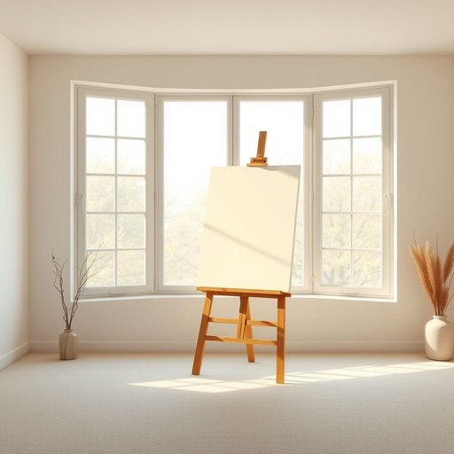

# easel

<h1 style="font-size: 2.5em; font-weight: 300; letter-spacing: 2px; margin: 0; color: #2c3e50;">
/ˈizəl/
</h1>

---

---

## 例句

After tidying up the living room, she carefully positioned the wooden easel, which had been a cherished gift from her grandmother, next to the large bay window so that the natural light would illuminate her canvas perfectly during afternoon painting sessions.

*After(/ˈæftər/) tidying(/tidying*/) up(/əp/) the(/ðə/) living(/ˈlɪvɪŋ/) room,(/rum,/) she(/ʃi/) carefully(/ˈkɛrfəli/) positioned(/pəˈzɪʃənd/) the(/ðə/) wooden(/ˈwʊdən/) easel,(/ˈizəl,/) which(/wɪʧ/) had(/hæd/) been(/bɪn/) a(/ə/) cherished(/ˈʧɛrɪʃt/) gift(/gɪft/) from(/frəm/) her(/hər/) grandmother,(/ˈgrændˌməðər,/) next(/nɛkst/) to(/tɪ/) the(/ðə/) large(/lɑrʤ/) bay(/beɪ/) window(/ˈwɪndoʊ/) so(/soʊ/) that(/ðət/) the(/ðə/) natural(/ˈnæʧərəl/) light(/laɪt/) would(/wʊd/) illuminate(/ˌɪˈlumɪnɪt/) her(/hər/) canvas(/ˈkænvəs/) perfectly(/ˈpərfəktli/) during(/ˈdʊrɪŋ/) afternoon(/ˌæftərˈnun/) painting(/ˈpeɪnɪŋ/) sessions.(/ˈsɛʃənz./)*

**翻译：** 整理好客厅后，她小心地将那架木质画架——这是祖母珍爱的礼物——摆放在大凸窗旁，以便自然光能在下午作画时完美地照亮画布。

---

## 解释

单词“easel”作为名词，指的是一种用于支撑画布或画板的三脚架或支架，常见于绘画和家居生活用品场景中，尤其是在艺术创作或展示作品时使用。具体使用场合通常包括家庭中的绘画角落、美术教室、画廊展览或摄影视觉布置中，帮助固定画布以便绘画或展示。英语学习者需要注意，“easel”是可数名词，常用复数形式“easels”；常见搭配有“paint on the easel”（在画架上作画）、“set up an easel”（搭建画架）、“wooden easel”（木制画架）等，表达时通常与绘画工具、画布等词搭配使用。此词源自荷兰语“ezel”，意为“驴”，因画架形状或其在支撑重物方面的稳固性被形象地比作“驴子”，这种形象化的比喻体现了其历史起源。中文翻译一般为“画架”，强调其支撑和固定画布或画板的功能，准确理解即为用于绘画活动的支撑工具，无特别褒贬意味或文化色彩，属于中性词汇，主要体现出实用性和艺术关联性。

---

<small style="color: #999; font-size: 0.9em;">2025-07-17 06:22:39</small>

