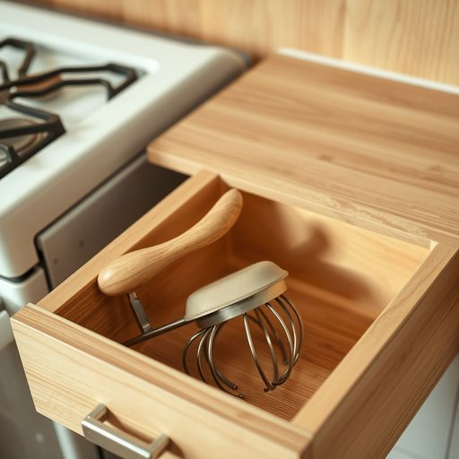

# egg-beater

<h1 style="font-size: 2.5em; font-weight: 300; letter-spacing: 2px; margin: 0; color: #2c3e50;">
/egg-beater*/
</h1>

---

---

## 例句

Before starting the cake batter, could you please fetch the egg-beater from the drawer next to the stove, the one with the wooden handle that Mum bought last Christmas, because using it will make the mixture far smoother and prevent those annoying lumps we always get when whisking by hand?

*Before(/ˌbiˈfɔr/) starting(/ˈstɑrtɪŋ/) the(/ðə/) cake(/keɪk/) batter,(/ˈbætər,/) could(/kʊd/) you(/ju/) please(/pliz/) fetch(/fɛʧ/) the(/ðə/) egg-beater(/egg-beater*/) from(/frəm/) the(/ðə/) drawer(/drɔr/) next(/nɛkst/) to(/tɪ/) the(/ðə/) stove,(/stoʊv,/) the(/ðə/) one(/wən/) with(/wɪθ/) the(/ðə/) wooden(/ˈwʊdən/) handle(/ˈhændəl/) that(/ðət/) Mum(/məm/) bought(/bɔt/) last(/læst/) Christmas,(/ˈkrɪsməs,/) because(/bɪˈkəz/) using(/ˈjuzɪŋ/) it(/ɪt/) will(/wɪl/) make(/meɪk/) the(/ðə/) mixture(/ˈmɪksʧər/) far(/fɑr/) smoother(/sˈmuðər/) and(/ənd/) prevent(/prɪˈvɛnt/) those(/ðoʊz/) annoying(/əˈnɔɪɪŋ/) lumps(/ləmps/) we(/wi/) always(/ˈɔlˌweɪz/) get(/gɪt/) when(/wɪn/) whisking(/whisking*/) by(/baɪ/) hand?(/hænd?/)*

**翻译：** 在开始调制蛋糕糊之前，能请你帮忙从炉灶旁的抽屉里取出那个带木柄的打蛋器吗？就是妈妈去年圣诞节买的那把，用它搅拌会让混合物更加顺滑，也能避免手工打蛋时总会出现的恼人结块。

---

## 解释

“egg-beater”作为名词，在家居生活用品的语境中主要指的是一种手动或电动的搅拌器，用来搅打蛋液、奶油或其他液态食材，常见于厨房烹饪和烘焙场合。使用时，英语学习者应注意该词通常用复合名词形式出现，前半部分是“egg”，后半部分是“beater”，其中“beater”指搅拌物的工具，整体表达专指搅打鸡蛋的器具。其常见搭配有“hand egg-beater”（手动蛋打器）、“electric egg-beater”（电动蛋打器），也可与动词“use”或“operate”搭配，如“use an egg-beater to whip the eggs”。语法上，“egg-beater”作为可数名词，复数形式为“egg-beaters”，在句中可作主语、宾语等，需根据具体语境正确运用冠词和数的变化。词源方面，该词由“egg”（鸡蛋）和“beater”（搅拌器）合成，直观表达了工具功能；“beater”一词源自古英语“beatan”，意指击打、搅拌，反映了该器具的使用方式。中文语境中，“egg-beater”通常准确翻译为“打蛋器”或“搅蛋器”，强调其专用于搅打蛋液的功能，无褒贬意味，属于中性词汇，体现的是厨房用具的实用工具属性。总体而言，理解“egg-beater”时应结合厨房烹饪场景，注意其具体指代和搭配习惯，同时掌握其构词背景以更好地理解和运用该词。

---

<small style="color: #999; font-size: 0.9em;">2025-07-17 06:22:39</small>

