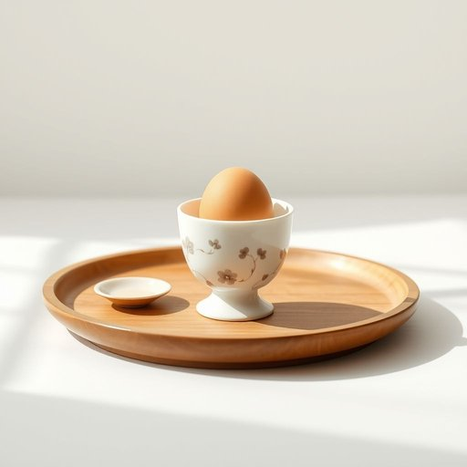

# egg-cup

<h1 style="font-size: 2.5em; font-weight: 300; letter-spacing: 2px; margin: 0; color: #2c3e50;">
/egg-cup*/
</h1>

---

---

## 例句

Could you please pass me the delicate porcelain egg-cup with the floral pattern that Grandma gave us last Christmas, so I can enjoy my soft-boiled egg properly without making a mess at the breakfast table?

*Could(/kʊd/) you(/ju/) please(/pliz/) pass(/pæs/) me(/mi/) the(/ðə/) delicate(/ˈdɛləkət/) porcelain(/ˈpɔrsələn/) egg-cup(/egg-cup*/) with(/wɪθ/) the(/ðə/) floral(/ˈflɔrəl/) pattern(/ˈpætərn/) that(/ðət/) Grandma(/ˈgrændmɑ/) gave(/geɪv/) us(/ˈjuˈɛs/) last(/læst/) Christmas,(/ˈkrɪsməs,/) so(/soʊ/) I(/aɪ/) can(/kən/) enjoy(/ˌɛnˈʤɔɪ/) my(/maɪ/) soft-boiled(/soft-boiled*/) egg(/ɛg/) properly(/ˈprɑpərli/) without(/wɪˈθaʊt/) making(/ˈmeɪkɪŋ/) a(/ə/) mess(/mɛs/) at(/æt/) the(/ðə/) breakfast(/ˈbrɛkfəst/) table?(/ˈteɪbəl?/)*

**翻译：** 您能帮我递一下那只祖母去年圣诞节送给我们的带花纹的精致瓷蛋杯吗？这样我就能好好享用我的溏心蛋，早餐时也不会弄得满桌狼藉。

---

## 解释

egg-cup作为名词，指的是一种家居生活用品，用于盛放煮熟的鸡蛋，使其立稳便于用餐，一般为小巧的杯状器皿，常见于早餐场合。英语学习者在使用该词时应注意其复合名词结构，egg表示“鸡蛋”，cup表示“杯子”，合成后的名词通常作为可数名词使用，复数形式为egg-cups。常见搭配有a set of egg-cups（一套餐具中的一组蛋杯）、a porcelain egg-cup（瓷蛋杯）等，可与材料、形状等形容词搭配使用。语法上，该词多用作具体物品的名称，在句中可做主语、宾语或定语，且拼写中间一般用连字符连接，强调复合词的整体性。词源上，egg-cup源自19世纪英国，最初设计用于方便食用软煮蛋，随着早餐文化的发展，其形状和材质多样化。该词在中文语境中准确翻译为蛋杯或蛋托，反映其功能性，即置放鸡蛋的小容器，使用时多与早餐或餐具相关联，无褒贬含义，属于中性词汇。在英美等西方国家，蛋杯体现了一种对早餐细节的讲究，兼具实用和美观，在家庭餐桌上较为常见，反映一定的生活品质和文化习惯。

---

<small style="color: #999; font-size: 0.9em;">2025-07-17 06:22:39</small>

