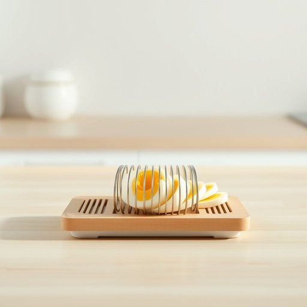

# egg-slicer

<h1 style="font-size: 2.5em; font-weight: 300; letter-spacing: 2px; margin: 0; color: #2c3e50;">
/egg-slicer*/
</h1>

---

---

## 例句

The egg-slicer sat neatly on the kitchen counter, its sharp, evenly spaced wires promising perfectly uniform slices of boiled egg, which made preparing the salad quicker and more efficient during our busy weekend brunch.

*The(/ðə/) egg-slicer(/egg-slicer*/) sat(/sæt/) neatly(/ˈnitli/) on(/ɔn/) the(/ðə/) kitchen(/ˈkɪʧən/) counter,(/ˈkaʊntər,/) its(/ɪts/) sharp,(/ʃɑrp,/) evenly(/ˈivənli/) spaced(/speɪst/) wires(/waɪərz/) promising(/ˈprɑməsɪŋ/) perfectly(/ˈpərfəktli/) uniform(/ˈjunəˌfɔrm/) slices(/sˈlaɪsɪz/) of(/əv/) boiled(/bɔɪld/) egg,(/ɛg,/) which(/wɪʧ/) made(/meɪd/) preparing(/pərˈpɛrɪŋ/) the(/ðə/) salad(/ˈsæləd/) quicker(/kˈwɪkər/) and(/ənd/) more(/mɔr/) efficient(/ɪˈfɪʃənt/) during(/ˈdʊrɪŋ/) our(/ɑr/) busy(/ˈbɪzi/) weekend(/ˈwiˌkɪnd/) brunch.(/brənʧ./)*

**翻译：** 切蛋器整齐地摆放在厨房台面上，锋利且间隔均匀的细线保证了煮鸡蛋切片的完美均匀，使我们在忙碌的周末早午餐期间准备沙拉更加快捷高效。

---

## 解释

“egg-slicer”作为名词，指的是一种厨房用具，专门用来将煮熟的鸡蛋均匀地切成薄片，通常由带有细金属丝的框架组成，用户将剥壳的鸡蛋放置在底部，然后将带有细丝的上部按下，即可切片。“egg-slicer”常用于家居生活用品的场景中，特别是在准备早餐、制作三明治或沙拉时使用，使用场合多为厨房或食物准备区域。英语学习者在使用“egg-slicer”时应注意它是一个复合名词，通常作为单数名词出现，复数形式为“egg-slicers”，且在表达上习惯与动词“use”或“have”等搭配，例如“use an egg-slicer to cut eggs”。此外，它常与“kitchen tool,”“kitchen gadget”以及具体食品搭配出现，如“sliced eggs from an egg-slicer”。词源上，“egg”意为“鸡蛋”，“slicer”源自动词“slice”，即“切片”，合成表示专门用于切蛋的工具，出现于20世纪中期厨房机械化和家用工具普及的背景下。中文语境中，“egg-slicer”通常准确译为“切蛋器”或“蛋切片器”，强调其专用功能，无特殊褒贬色彩，也无特殊文化含义，属于实用工具类词汇，帮助使用者高效且均匀地切割鸡蛋，提高食物制作的便利性和美观性。

---

<small style="color: #999; font-size: 0.9em;">2025-07-17 06:22:39</small>

