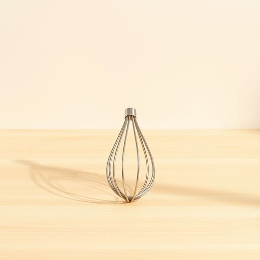

# egg-whisk

<h1 style="font-size: 2.5em; font-weight: 300; letter-spacing: 2px; margin: 0; color: #2c3e50;">
/egg-whisk*/
</h1>

---

---

## 例句

Before you start mixing the batter, could you please hand me the egg-whisk that’s tucked away next to the blender on the top shelf, since using it will ensure the eggs are perfectly aerated and the mixture achieves that light, fluffy texture we both love in homemade cakes?

*Before(/ˌbiˈfɔr/) you(/ju/) start(/stɑrt/) mixing(/ˈmɪksɪŋ/) the(/ðə/) batter,(/ˈbætər,/) could(/kʊd/) you(/ju/) please(/pliz/) hand(/hænd/) me(/mi/) the(/ðə/) egg-whisk(/egg-whisk*/) that’s(/that’s*/) tucked(/təkt/) away(/əˈweɪ/) next(/nɛkst/) to(/tɪ/) the(/ðə/) blender(/ˈblɛndər/) on(/ɔn/) the(/ðə/) top(/tɔp/) shelf,(/ʃɛlf,/) since(/sɪns/) using(/ˈjuzɪŋ/) it(/ɪt/) will(/wɪl/) ensure(/ɪnˈʃʊr/) the(/ðə/) eggs(/ɛgz/) are(/ər/) perfectly(/ˈpərfəktli/) aerated(/aerated*/) and(/ənd/) the(/ðə/) mixture(/ˈmɪksʧər/) achieves(/əˈʧivz/) that(/ðət/) light,(/laɪt,/) fluffy(/ˈfləfi/) texture(/ˈtɛksʧər/) we(/wi/) both(/boʊθ/) love(/ləv/) in(/ɪn/) homemade(/ˈhoʊˈmeɪd/) cakes?(/keɪks?/)*

**翻译：** 在开始搅拌面糊之前，你能帮我递一下藏在最上层架子、搅拌机旁边的蛋抽吗？用它打发蛋液，能确保蛋液充分充气，使混合物达到那种我们都喜欢的自制蛋糕特有的轻盈蓬松质感。

---

## 解释

“egg-whisk”作为名词，指的是一种厨房用具，中文常译为“打蛋器”或“搅拌器”，专门用于将鸡蛋或其他液体食材快速打散、搅拌均匀，常见于家庭烹饪过程中制作蛋液、奶油或面糊时使用。这个词典型的使用场合是在厨房环境，尤其是在准备糕点、甜点或需要轻柔混合材料的菜肴中。英语学习者使用“egg-whisk”时需注意它通常作为可数名词出现，且复数形式为“egg-whisks”，与动词“whisk”不同，“whisk”作为名词时也指类似工具，但“egg-whisk”更具体指用于打蛋的工具。此外，常见用法包括搭配介词如“with an egg-whisk”（用打蛋器），表达技巧上，强调工具时用复合名词“egg-whisk”比单纯“whisk”更具指向性。词源方面，“egg-whisk”由“egg”（蛋）与“whisk”（搅拌、拍打）合成，后者源自中古英语，原意为快速挥动，表现出该工具的快速搅打作用，整体体现了其专用功能的直观描述。在中文语境中，“egg-whisk”应理解为专用的厨房搅拌工具，区别于电动搅拌器或其他手动工具，强调手持且结构简单，通常为金属丝制成，文化上无贬义或特殊色彩，实用性强且中性。

---

<small style="color: #999; font-size: 0.9em;">2025-07-17 06:22:39</small>

