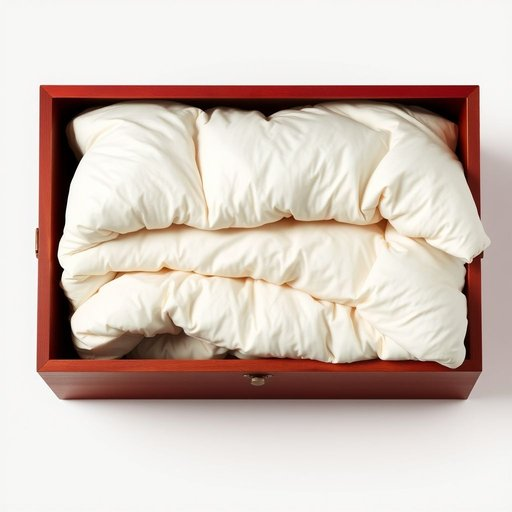

# eiderdown

<h1 style="font-size: 2.5em; font-weight: 300; letter-spacing: 2px; margin: 0; color: #2c3e50;">
/eiderdown*/
</h1>

---

---

## 例句

I was absolutely delighted when I found that heirloom eiderdown tucked away in the cedar chest at the end of the hallway, as its exquisite craftsmanship and incredibly soft, insulating feathers not only promise to keep us warm during the chilly winter nights but also add a touch of vintage charm to our bedroom décor, which is exactly the cozy atmosphere we’ve been striving to create.

*I(/aɪ/) was(/wɑz/) absolutely(/ˌæbsəˈlutli/) delighted(/dɪˈlaɪtɪd/) when(/wɪn/) I(/aɪ/) found(/faʊnd/) that(/ðət/) heirloom(/ˈɛˌrlum/) eiderdown(/eiderdown*/) tucked(/təkt/) away(/əˈweɪ/) in(/ɪn/) the(/ðə/) cedar(/ˈsidər/) chest(/ʧɛst/) at(/æt/) the(/ðə/) end(/ɛnd/) of(/əv/) the(/ðə/) hallway,(/ˈhɔlˌweɪ,/) as(/ɛz/) its(/ɪts/) exquisite(/ˈɛkskwəzət/) craftsmanship(/ˈkræftsmənˌʃɪp/) and(/ənd/) incredibly(/ˌɪnˈkrɛdəbli/) soft,(/sɔft,/) insulating(/ˈɪnsəˌleɪtɪŋ/) feathers(/ˈfɛðərz/) not(/nɑt/) only(/ˈoʊnli/) promise(/ˈprɑməs/) to(/tɪ/) keep(/kip/) us(/ˈjuˈɛs/) warm(/wɔrm/) during(/ˈdʊrɪŋ/) the(/ðə/) chilly(/ˈʧɪli/) winter(/ˈwɪntər/) nights(/naɪts/) but(/bət/) also(/ˈɔlsoʊ/) add(/æd/) a(/ə/) touch(/təʧ/) of(/əv/) vintage(/ˈvɪntɪʤ/) charm(/ʧɑrm/) to(/tɪ/) our(/ɑr/) bedroom(/ˈbɛˌdrum/) décor,(/décor*,/) which(/wɪʧ/) is(/ɪz/) exactly(/ɪgˈzæktli/) the(/ðə/) cozy(/ˈkoʊzi/) atmosphere(/ˈætməsˌfɪr/) we’ve(/we’ve*/) been(/bɪn/) striving(/ˈstraɪvɪŋ/) to(/tɪ/) create.(/kriˈeɪt./)*

**翻译：** 当我发现那件珍藏的鸭绒被藏在走廊尽头的雪松箱里时，心中不禁欢喜万分。它精湛的工艺和异常柔软、保温的羽毛不仅保证了我们在寒冷的冬夜里温暖如春，也为我们的卧室装饰增添了一抹复古的韵味，正是我们一直努力营造的那种温馨氛围。

---

## 解释

英语单词“eiderdown”作为名词在家居生活用品场景中，指的是一种以海狸鸭（eider duck）羽毛制成的柔软、保暖的羽绒被或羽绒填充物，常用于制作被褥、枕头等床上用品，特别适合寒冷环境下使用。具体使用场合多见于描述卧室用品、床上保暖物品或高档羽绒制品时，如“a warm eiderdown for winter”（冬季用的温暖羽绒被）。英语学习者需要注意“eiderdown”作为不可数名词时通常直接表示羽绒填充物，作可数名词时则指代具体的羽绒被；在用法上多与形容词搭配，如“soft eiderdown”或“thick eiderdown”，表达其质感或厚度，且不能与普通的“down”混淆，后者泛指所有鸭鹅绒。词源方面，“eiderdown”源自18世纪英语，结合了“eider”指代产羽毛的海狸鸭及“down”指鸭、鹅绒，反映其取材自海狸鸭柔软羽毛的特点，此羽毛因极佳的保暖性能和轻盈质感而被珍视。中文语境中，“eiderdown”准确翻译为“海狸鸭绒被”或简称“海狸绒被”，强调其高档天然羽绒填充来源，区别于普通羽绒被，通常带有一定的奢华和品质象征，无明显褒贬色彩，但因原料稀缺，价格较高，有时用于表现生活品质或讲究的家居环境。

---

<small style="color: #999; font-size: 0.9em;">2025-07-17 06:22:39</small>

