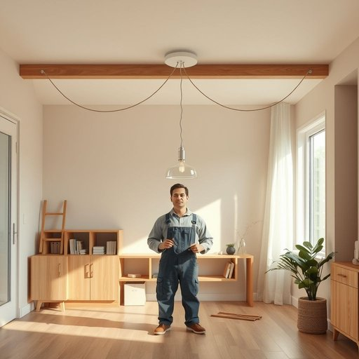

# electrics

<h1 style="font-size: 2.5em; font-weight: 300; letter-spacing: 2px; margin: 0; color: #2c3e50;">
/ɪˈlɛktrɪks/
</h1>

---

---

## 例句

Before embarking on the renovation project, the electrician meticulously examined the electrics to ensure that every wire, socket, and light fitting met safety standards, acknowledging that neglecting these components could result in both a hazardous fire risk and the potential nullification of the homeowner's insurance coverage.

*Before(/ˌbiˈfɔr/) embarking(/ɛmˈbɑrkɪŋ/) on(/ɔn/) the(/ðə/) renovation(/ˌrɛnəˈveɪʃən/) project,(/ˈprɑʤɛkt,/) the(/ðə/) electrician(/ɪlɛkˈtrɪʃən/) meticulously(/məˈtɪkjələsli/) examined(/ɪgˈzæmənd/) the(/ðə/) electrics(/ɪˈlɛktrɪks/) to(/tɪ/) ensure(/ɪnˈʃʊr/) that(/ðət/) every(/ˈɛvəri/) wire,(/waɪər,/) socket,(/ˈsɑkət,/) and(/ənd/) light(/laɪt/) fitting(/ˈfɪtɪŋ/) met(/mɛt/) safety(/ˈseɪfti/) standards,(/ˈstændərdz,/) acknowledging(/ækˈnɑlɪʤɪŋ/) that(/ðət/) neglecting(/nɪˈglɛktɪŋ/) these(/ðiz/) components(/kəmˈpoʊnənts/) could(/kʊd/) result(/rɪˈzəlt/) in(/ɪn/) both(/boʊθ/) a(/ə/) hazardous(/ˈhæzərdəs/) fire(/faɪər/) risk(/rɪsk/) and(/ənd/) the(/ðə/) potential(/pəˈtɛnʃəl/) nullification(/ˌnələfəˈkeɪʃən/) of(/əv/) the(/ðə/) homeowner's(/ˈhoʊˌmoʊnərz/) insurance(/ˌɪnˈʃʊrəns/) coverage.(/ˈkəvərɪʤ./)*

**翻译：** 在开始装修工程之前，电工细致地检查了电路，确保每根电线、插座和灯具均符合安全标准，因为他清楚忽视这些部件不仅可能引发危险的火灾风险，还可能导致房主的保险失效。

---

## 解释

英语单词“electrics”作为名词主要用于指代与电力系统相关的电气设备、装置或电线，尤其是在家居生活用品场景中，常用来描述房屋内部的电气线路、配电装置及电气相关的设施，如“the electrics in the house need repair”（房子的电气系统需要修理）。该词通常以复数形式出现，表明一组电气元件或系统，而非单一设备。英语学习者使用“electrics”时要注意它的复数形式及其不可数的语境，如不能直接说“an electric”，而应该用“an electric device”或“electrics”指整套系统；此外，该词常与修理、安装（repair, install）等动词搭配，也可用作复数主语。词源方面，“electrics”源自拉丁语“electricus”，意为“产生电的”，而“electricus”又来自希腊语“ēlektron”（意指琥珀，因摩擦琥珀可产生静电）。在中文语境中，“electrics”通常被准确翻译为“电气系统”或“电气设备”，凸显的是现代家庭或建筑中用于供电和控制的全部电力相关装置，而非单一的电器产品。该词本身无明显褒贬色彩，属于技术性描述词汇，但在实际使用中，因涉及安全隐患与维护，可能隐含“需要注意”或“必须专业处理”的文化内涵。总体而言，“electrics”在家居场景中指的不是具体电器，而是支撑这些电器运行的电气系统或装置，理解时应避免与“electrical appliances”（电器产品）混淆。

---

<small style="color: #999; font-size: 0.9em;">2025-07-17 06:22:39</small>

