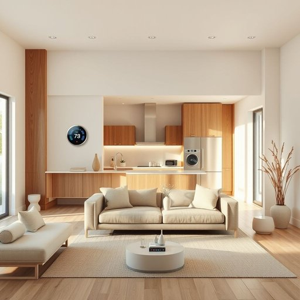

# electronics

<h1 style="font-size: 2.5em; font-weight: 300; letter-spacing: 2px; margin: 0; color: #2c3e50;">
/ˌɪˌlɛkˈtrɑnɪks/
</h1>

---

---

## 例句

Since the new landlord insisted that all electronics, including the smart thermostat, the wireless speakers, and the kitchen appliances, be unplugged during the renovation, we've had to find alternative ways to stay comfortable and entertained at home.

*Since(/sɪns/) the(/ðə/) new(/nu/) landlord(/ˈlænˌdlɔrd/) insisted(/ˌɪnˈsɪstɪd/) that(/ðət/) all(/ɔl/) electronics,(/ˌɪˌlɛkˈtrɑnɪks,/) including(/ˌɪnˈkludɪŋ/) the(/ðə/) smart(/smɑrt/) thermostat,(/ˈθərməˌstæt,/) the(/ðə/) wireless(/ˈwaɪrlɪs/) speakers,(/ˈspikərz,/) and(/ənd/) the(/ðə/) kitchen(/ˈkɪʧən/) appliances,(/əˈplaɪənsɪz,/) be(/bi/) unplugged(/ˈənˈpləgd/) during(/ˈdʊrɪŋ/) the(/ðə/) renovation,(/ˌrɛnəˈveɪʃən,/) we've(/wiv/) had(/hæd/) to(/tɪ/) find(/faɪnd/) alternative(/ɔlˈtərnətɪv/) ways(/weɪz/) to(/tɪ/) stay(/steɪ/) comfortable(/ˈkəmfərtəbəl/) and(/ənd/) entertained(/ˌɛnərˈteɪnd/) at(/æt/) home.(/hoʊm./)*

**翻译：** 由于新房东坚持要求装修期间所有电子设备包括智能恒温器、无线音箱和厨房电器都必须拔掉插头，我们不得不寻找其他方式来保证在家中的舒适与娱乐。

---

## 解释

英语单词“electronics”作为名词，在家居生活用品的语境中通常指的是各种基于电子技术的设备和装置，如电视机、音响系统、微波炉、智能家居设备等，使用场合多见于消费者购买、使用或讨论家庭电器时。语法上，“electronics”为不可数名词，通常不直接加复数形式，且使用时多接单数动词，但它也可以泛指电子产品的类别，因此常见搭配有“consumer electronics”（消费电子产品）、“home electronics”（家用电子产品）等，使用时注意区分具体设备名称和泛指类别的表达。词源方面，“electronics”源自“electronic”加上复数及集体名词后缀“s”，其根基是希腊语“electron”（电子，琥珀），反映了电子学作为研究电子及其应用的学科起始于20世纪初。中文语境中，“electronics”准确翻译为“电子产品”或“电子器件”，强调的是涉及电子技术的设备和用品，没有褒贬色彩，属于中性词汇，广泛用于描述现代家居中各种智能和电子设备。在语言文化层面，electronics往往与现代化、科技进步联系紧密，体现了技术对生活的便利性提升，而非单纯的机械或传统电器，因而使用时也可传达出时尚或高科技的含义。

---

<small style="color: #999; font-size: 0.9em;">2025-07-17 06:22:39</small>

