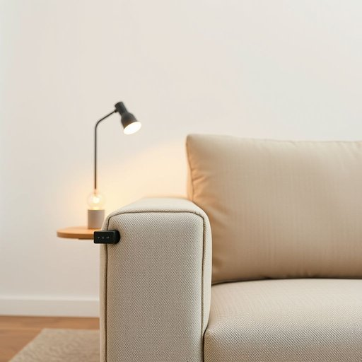

# end

<h1 style="font-size: 2.5em; font-weight: 300; letter-spacing: 2px; margin: 0; color: #2c3e50;">
/ɛnd/
</h1>

---

---

## 例句

Could you please check if the cable at that end of the sofa has come loose, since the lamp keeps flickering even though the bulb is brand new and the switch on the other end works perfectly?

*Could(/kʊd/) you(/ju/) please(/pliz/) check(/ʧɛk/) if(/ɪf/) the(/ðə/) cable(/ˈkeɪbəl/) at(/æt/) that(/ðət/) end(/ɛnd/) of(/əv/) the(/ðə/) sofa(/ˈsoʊfə/) has(/həz/) come(/kəm/) loose,(/lus,/) since(/sɪns/) the(/ðə/) lamp(/læmp/) keeps(/kips/) flickering(/ˈflɪkərɪŋ/) even(/ˈivɪn/) though(/ðoʊ/) the(/ðə/) bulb(/bəlb/) is(/ɪz/) brand(/brænd/) new(/nu/) and(/ənd/) the(/ðə/) switch(/swɪʧ/) on(/ɔn/) the(/ðə/) other(/ˈəðər/) end(/ɛnd/) works(/wərks/) perfectly?(/ˈpərfəktli?/)*

**翻译：** 请您帮忙检查一下沙发那一端的电线是否松动，因为灯泡虽然是全新的，但灯仍然不断闪烁，而另一端的开关完全正常。

---

## 解释

在家居生活用品的语境中，名词“end”通常指物品的“末端”或“边缘”，例如桌子的两端、床的靠近头部或脚部的一端，或者家具部件的端点位置。具体使用场合常见于描述家具结构、布置或修改物品时的定位，如“the ends of the table”（桌子的两端），“the bed end”（床尾）。英语学习者在使用“end”作为名词时应注意，它通常作为可数名词出现，表示具体位置，常与定冠词the连用，搭配介词短语如“at the end of...”表示“在……的末端”，此外还可用于复数形式“ends”表示两个或多个末端或边缘。在表达技巧上，避免将其与动词“end”（结束）混淆，名词用法侧重于空间位置。词源方面，“end”来自古英语“endian”，意为“终结、末尾”，其基本含义与现代用法保持一致，体现出事物的界限或终点。在中文语境中，“end”准确翻译为“末端”“尽头”“端部”等，强调空间上的终点位置，无特殊褒贬意义，属于中性词汇，但在家居生活场合多用于指示具体位置，便于明确物品结构或摆放方位。整体而言，“end”作为名词在家居用品中是一个基本且常用的空间定位词，理解和使用时应注重其物理位置的含义。

---

<small style="color: #999; font-size: 0.9em;">2025-07-17 06:22:39</small>

