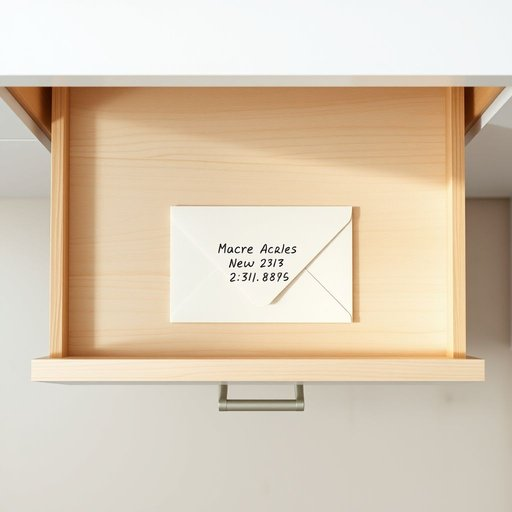

# envelope

<h1 style="font-size: 2.5em; font-weight: 300; letter-spacing: 2px; margin: 0; color: #2c3e50;">
/ˈɛnvəˌloʊp/
</h1>

---

---

## 例句

The kitchen drawer’s organization, marked by the presence of a small cream-coloured envelope bearing a handwritten address, was crucial for locating the important documents required for the afternoon’s post office dispatch.

*The(/ðə/) kitchen(/ˈkɪʧən/) drawer’s(/drawer’s*/) organization,(/ˌɔrgənəˈzeɪʃən,/) marked(/mɑrkt/) by(/baɪ/) the(/ðə/) presence(/ˈprɛzəns/) of(/əv/) a(/ə/) small(/smɔl/) cream-coloured(/cream-coloured*/) envelope(/ˈɛnvəˌloʊp/) bearing(/ˈbɛrɪŋ/) a(/ə/) handwritten(/ˈhænˌdrɪtən/) address,(/ˈæˌdrɛs,/) was(/wɑz/) crucial(/ˈkruʃəl/) for(/fər/) locating(/ˈloʊˌkeɪtɪŋ/) the(/ðə/) important(/ˌɪmˈpɔrtənt/) documents(/ˈdɑkjəmənts/) required(/rikˈwaɪərd/) for(/fər/) the(/ðə/) afternoon’s(/afternoon’s*/) post(/poʊst/) office(/ˈɔfəs/) dispatch.(/dɪˈspæʧ./)*

**翻译：** 厨房抽屉的整理状况尤为关键，其中放着一个小巧的奶油色信封，信封上写着手写地址，正是找到下午邮局寄送所需重要文件的关键所在。

---

## 解释

英语单词'envelope'作为名词在家居生活用品场景中主要指信封，即用于装信件或小纸张的薄纸套，常见于邮寄、收发信件或家庭办公环境中。在使用时，英语学习者应注意envelope是可数名词，复数形式为envelopes，通常与动词如“open”、“seal”、“address”、“put”、“mail”等搭配，如“open an envelope（打开信封）”、“seal the envelope（封口）”和“address the envelope（写地址）”。此外，envelope通常作为具体可触物存在，不宜与表示抽象概念的用法混淆。词源方面，envelope来源于法语“enveloppe”，意为包裹、包装物，其根源可追溯至拉丁语“involoper”，意指包裹、包围，反映了其包覆某物的功能。在中文语境中，envelope准确翻译为“信封”，指纸质或塑料制品，用于装载信件或文件，需注意与“包裹”（parcel或package）区分。该词本身无特殊褒贬含义或文化色彩，属于日常生活中常见且中性词汇，但在正式书信或邮寄活动中其正确使用体现了礼仪和规范。

---

<small style="color: #999; font-size: 0.9em;">2025-07-17 06:22:39</small>

