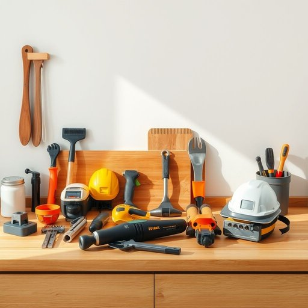

# equipment

<h1 style="font-size: 2.5em; font-weight: 300; letter-spacing: 2px; margin: 0; color: #2c3e50;">
/ɪkˈwɪpmənt/
</h1>

---

---

## 例句

Before we start renovating the kitchen, we need to make sure all the necessary equipment, including the power tools that Martine lent us and the safety gear we bought last week, is in good working order so that the whole process can run smoothly and without any unexpected delays.

*Before(/ˌbiˈfɔr/) we(/wi/) start(/stɑrt/) renovating(/ˈrɛnəˌveɪtɪŋ/) the(/ðə/) kitchen,(/ˈkɪʧən,/) we(/wi/) need(/nid/) to(/tɪ/) make(/meɪk/) sure(/ʃʊr/) all(/ɔl/) the(/ðə/) necessary(/ˈnɛsəˌsɛri/) equipment,(/ɪkˈwɪpmənt,/) including(/ˌɪnˈkludɪŋ/) the(/ðə/) power(/paʊər/) tools(/tulz/) that(/ðət/) Martine(/mɑrˈtin/) lent(/lɛnt/) us(/ˈjuˈɛs/) and(/ənd/) the(/ðə/) safety(/ˈseɪfti/) gear(/gɪr/) we(/wi/) bought(/bɔt/) last(/læst/) week,(/wik,/) is(/ɪz/) in(/ɪn/) good(/gʊd/) working(/ˈwərkɪŋ/) order(/ˈɔrdər/) so(/soʊ/) that(/ðət/) the(/ðə/) whole(/hoʊl/) process(/ˈprɔˌsɛs/) can(/kən/) run(/rən/) smoothly(/sˈmuðli/) and(/ənd/) without(/wɪˈθaʊt/) any(/ˈɛni/) unexpected(/ˌənɪkˈspɛktɪd/) delays.(/dɪˈleɪz./)*

**翻译：** 在开始厨房装修之前，我们需要确认所有必备设备，包括Martine借给我们的电动工具以及上周购买的安全防护用品，均处于良好状态，以确保整个施工过程顺利进行，不会出现任何意外的延误。

---

## 解释

英语单词“equipment”作为名词在家居生活用品的语境中，通常指用于特定活动或功能的器材、工具或装置，如厨房设备、清洁设备等，强调物品的集合或总称，而非单个具体物品。英语学习者需注意，“equipment”是不可数名词，不能直接用复数形式，也不能与不定冠词“a/an”连用，通常搭配量词如“some equipment”或“一件设备”。常见搭配包括“kitchen equipment”（厨房设备）、“exercise equipment”（健身器材）、“electrical equipment”（电气设备）等。该词源自法语“équiper”，意为“装备”，其根源为古法语“equipment”，引申为准备或配备所需的物品，体现物品功能性和用途的集合性。在中文语境中，“equipment”通常翻译为“设备”、“器材”或“装备”，侧重于一套用于特定用途的工具或机械装备，侧重功能性而非装饰性，在家居生活中指用于帮助实现生活便利或特定功能的器具。此词无特殊褒贬色彩，属于中性词汇，但在某些场合强调专业性或技术性，体现配套完整和功能齐备的含义。

---

<small style="color: #999; font-size: 0.9em;">2025-07-17 06:22:39</small>

