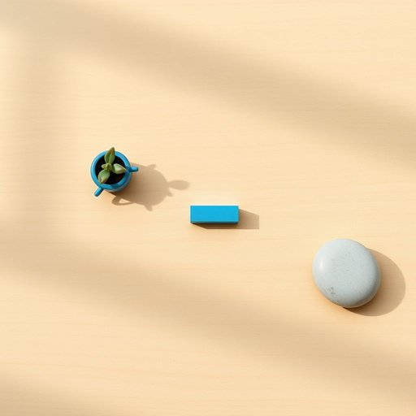

# eraser

<h1 style="font-size: 2.5em; font-weight: 300; letter-spacing: 2px; margin: 0; color: #2c3e50;">
/ɪˈreɪsər/
</h1>

---

---

## 例句

Could you please pass me the eraser that’s usually kept in the top drawer of the desk, the one with the blue casing which I bought last month because it’s especially good at removing pencil marks without smudging, as I need to correct this sketch before the light fades?

*Could(/kʊd/) you(/ju/) please(/pliz/) pass(/pæs/) me(/mi/) the(/ðə/) eraser(/ɪˈreɪsər/) that’s(/that’s*/) usually(/ˈjuʒəwəli/) kept(/kɛpt/) in(/ɪn/) the(/ðə/) top(/tɔp/) drawer(/drɔr/) of(/əv/) the(/ðə/) desk,(/dɛsk,/) the(/ðə/) one(/wən/) with(/wɪθ/) the(/ðə/) blue(/blu/) casing(/ˈkeɪsɪŋ/) which(/wɪʧ/) I(/aɪ/) bought(/bɔt/) last(/læst/) month(/mənθ/) because(/bɪˈkəz/) it’s(/it’s*/) especially(/əˈspɛʃəli/) good(/gʊd/) at(/æt/) removing(/riˈmuvɪŋ/) pencil(/ˈpɛnsəl/) marks(/mɑrks/) without(/wɪˈθaʊt/) smudging,(/smudging*,/) as(/ɛz/) I(/aɪ/) need(/nid/) to(/tɪ/) correct(/kərˈɛkt/) this(/ðɪs/) sketch(/skɛʧ/) before(/ˌbiˈfɔr/) the(/ðə/) light(/laɪt/) fades?(/feɪdz?/)*

**翻译：** 请你帮我递一下那个通常放在书桌顶层抽屉里的橡皮，是我上个月买的蓝色外壳那款，因为它特别擅长去除铅笔痕迹且不易晕染，我需要用它在天色渐暗之前修改这幅草图。

---

## 解释

英语单词"eraser"作为名词，通常指用于擦除铅笔等痕迹的橡皮擦，是家居生活和学习用品中常见的文具之一。具体使用场合多见于书写或绘画环境，例如学生课堂、办公桌面或家庭书房中，用来修正写错的字迹或作图时需要更改的部分。英语学习者在使用"eraser"时，应注意其为可数名词，复数形式为"erasers"，常见搭配有"rubber eraser"（英式英语中"rubber"亦指橡皮擦）、"pencil eraser"（铅笔擦）、"white eraser"（白色橡皮）等。此外，"eraser"多用于指物理擦除工具，无隐喻或特殊褒贬含义，语境清晰直接。词源上，"eraser"源自动词"erase"，而"erase"来自拉丁语"erasus"（擦掉、抹去），通过法语"eracer"进入英语，体现了其根本功能“擦除”的本质。中文语境中，"eraser"一般译为“橡皮”或“橡皮擦”，强调其用于擦掉铅笔痕迹的用途，准确传达了该物品的功能和形态，且在家居生活用品分类中明确属于文具范畴，无特殊文化内涵或情感色彩。

---

<small style="color: #999; font-size: 0.9em;">2025-07-17 06:22:39</small>

