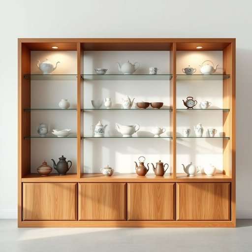

# etagere

<h1 style="font-size: 2.5em; font-weight: 300; letter-spacing: 2px; margin: 0; color: #2c3e50;">
/etagere*/
</h1>

---

---

## 例句

When Sarah invited her friends over for afternoon tea, she proudly pointed to the antique etagere in the corner, explaining how its multiple glass shelves, delicately framed in polished oak, not only showcased her collection of fine china and vintage teapots but also added an elegant touch to the otherwise modest dining room.

*When(/wɪn/) Sarah(/ˈsɛrə/) invited(/ˌɪnˈvaɪtɪd/) her(/hər/) friends(/frɛndz/) over(/ˈoʊvər/) for(/fər/) afternoon(/ˌæftərˈnun/) tea,(/ti,/) she(/ʃi/) proudly(/ˈpraʊdli/) pointed(/ˈpɔɪntɪd/) to(/tɪ/) the(/ðə/) antique(/ænˈtik/) etagere(/etagere*/) in(/ɪn/) the(/ðə/) corner,(/ˈkɔrnər,/) explaining(/ɪkˈspleɪnɪŋ/) how(/haʊ/) its(/ɪts/) multiple(/ˈməltəpəl/) glass(/glæs/) shelves,(/ʃɛlvz,/) delicately(/ˈdɛləkətli/) framed(/freɪmd/) in(/ɪn/) polished(/ˈpɑlɪʃt/) oak,(/oʊk,/) not(/nɑt/) only(/ˈoʊnli/) showcased(/ˈʃoʊˌkeɪst/) her(/hər/) collection(/kəˈlɛkʃən/) of(/əv/) fine(/faɪn/) china(/ˈʧaɪnə/) and(/ənd/) vintage(/ˈvɪntɪʤ/) teapots(/teapots*/) but(/bət/) also(/ˈɔlsoʊ/) added(/ˈædɪd/) an(/ən/) elegant(/ˈɛləgənt/) touch(/təʧ/) to(/tɪ/) the(/ðə/) otherwise(/ˈəðərˌwaɪz/) modest(/ˈmɑdəst/) dining(/ˈdaɪnɪŋ/) room.(/rum./)*

**翻译：** 当莎拉邀请朋友们来家中喝下午茶时，她自豪地指着角落里的古董玻璃陈列柜，解释说那多层玻璃架精致地镶嵌在抛光橡木框架中，不仅展示了她收藏的精美瓷器和复古茶壶，还为这间原本简朴的餐厅增添了一抹优雅的气息。

---

## 解释

etagere作为英语中的名词，主要指一种多层的开放式架子或展示架，通常用于家居环境中陈列小型装饰品、书籍、植物或餐具等，常见于客厅、餐厅或书房等空间，具有既实用又装饰性的功能。英语学习者在使用该词时应注意它是可数名词，单数形式为etagere，复数为etageres，通常与定冠词the或不定冠词a/an连用，常见搭配有an etagere stand、a wooden etagere等。由于此词较为正式且带有一定的复古和优雅色彩，常用于描写较为精致或传统的家居布置。在词源上，etagere源自法语，意为层架，étagère是法语中étage（楼层、层级）的衍生词，传入英语后保持了原法语的拼写和含义。中文语境中，etagere通常被译为展示架、层架或多层摆架，体现其多层且开放的结构特征。需要注意的是，该词无明显褒贬义，属于中性词汇，但因其法语背景和家具风格，常带有一种优雅、复古的文化内涵，适合用于描述高档或装饰性较强的家居用品和摆设。

---

<small style="color: #999; font-size: 0.9em;">2025-07-17 06:22:39</small>

