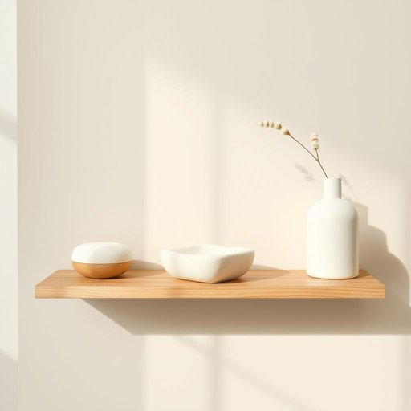

# exfoliator

<h1 style="font-size: 2.5em; font-weight: 300; letter-spacing: 2px; margin: 0; color: #2c3e50;">
/exfoliator*/
</h1>

---

---

## 例句

Before you shower, make sure to use the exfoliator I bought last week, which not only removes dead skin cells effectively but also contains natural ingredients that leave your skin feeling incredibly smooth and refreshed.

*Before(/ˌbiˈfɔr/) you(/ju/) shower,(/ʃaʊər,/) make(/meɪk/) sure(/ʃʊr/) to(/tɪ/) use(/juz/) the(/ðə/) exfoliator(/exfoliator*/) I(/aɪ/) bought(/bɔt/) last(/læst/) week,(/wik,/) which(/wɪʧ/) not(/nɑt/) only(/ˈoʊnli/) removes(/riˈmuvz/) dead(/dɛd/) skin(/skɪn/) cells(/sɛlz/) effectively(/ˈifɛktɪvli/) but(/bət/) also(/ˈɔlsoʊ/) contains(/kənˈteɪnz/) natural(/ˈnæʧərəl/) ingredients(/ˌɪnˈgridiənts/) that(/ðət/) leave(/liv/) your(/jʊr/) skin(/skɪn/) feeling(/ˈfilɪŋ/) incredibly(/ˌɪnˈkrɛdəbli/) smooth(/smuð/) and(/ənd/) refreshed.(/riˈfrɛʃt./)*

**翻译：** 在你洗淋浴之前，务必使用我上周购买的去角质产品，它不仅能有效去除死皮细胞，还含有天然成分，使你的肌肤感到格外光滑清爽。

---

## 解释

英语单词“exfoliator”作为名词，在家居生活用品的语境中指的是用于去除皮肤表面角质或死皮的产品或工具，常见于护肤和美容领域，如磨砂膏、去角质刷或去角质海绵等。具体使用场合通常是在护肤步骤中，帮助提升皮肤光滑度和促进新陈代谢。英语学习者在使用“exfoliator”时应注意它是可数名词，可与冠词连用，如“an exfoliator”或复数形式“exfoliators”，且常与动词“use”、“apply”搭配，如“use an exfoliator”，此外，常见的表达组合还有“physical exfoliator”（物理去角质剂）和“chemical exfoliator”（化学去角质剂）。词源上，“exfoliator”来源于拉丁语“exfoliare”，由前缀“ex-”（向外）和“folium”（叶子）组成，原意为剥落叶子，引申到皮肤去除死皮的动作，具有形象且逻辑的语言演变。中文中，“exfoliator”通常翻译为“去角质产品”或“去角质剂”，理解为专门用于清除皮肤表面老化角质层的产品，强调其功能性和护肤作用。在文化内涵上，这个词一般无明显褒贬色彩，但在护肤美容领域通常具积极意义，体现健康护肤的潮流和对皮肤护理细节的重视，使用时注意结合具体产品类型及使用方法，避免与“exfoliate”作为动词混淆。

---

<small style="color: #999; font-size: 0.9em;">2025-07-17 06:22:39</small>

