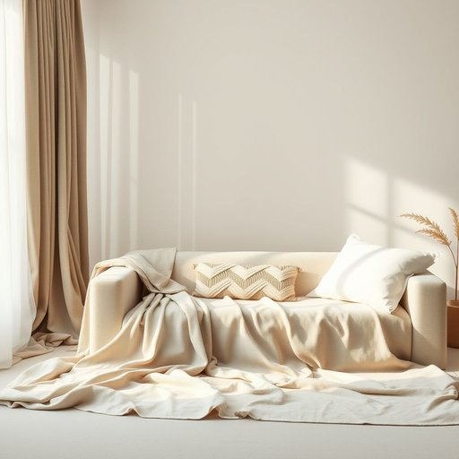

# fabric

<h1 style="font-size: 2.5em; font-weight: 300; letter-spacing: 2px; margin: 0; color: #2c3e50;">
/ˈfæbrɪk/
</h1>

---

---

## 例句

The fabric used in the designer’s latest collection, which incorporates intricate patterns inspired by ancient tapestries and is crafted from sustainable materials, has garnered widespread acclaim for its unique texture and environmental benefits.

*The(/ðə/) fabric(/ˈfæbrɪk/) used(/juzd/) in(/ɪn/) the(/ðə/) designer’s(/designer’s*/) latest(/ˈleɪtəst/) collection,(/kəˈlɛkʃən,/) which(/wɪʧ/) incorporates(/ˌɪnˈkɔrpərˌeɪts/) intricate(/ˈɪntrəkət/) patterns(/ˈpætərnz/) inspired(/ˌɪnˈspaɪərd/) by(/baɪ/) ancient(/ˈeɪnʧənt/) tapestries(/ˈtæpəstriz/) and(/ənd/) is(/ɪz/) crafted(/ˈkræftɪd/) from(/frəm/) sustainable(/səˈsteɪnəbəl/) materials,(/məˈtɪriəlz,/) has(/həz/) garnered(/ˈgɑrnərd/) widespread(/ˈwaɪdˈsprɛd/) acclaim(/əˈkleɪm/) for(/fər/) its(/ɪts/) unique(/juˈnik/) texture(/ˈtɛksʧər/) and(/ənd/) environmental(/ɪnˌvaɪrənˈmɛnəl/) benefits.(/ˈbɛnəfɪts./)*

**翻译：** 设计师最新系列所采用的面料融合了灵感源自古代挂毯的精致图案，且由可持续材料制成，因其独特的质感和环保优势而广受赞誉。

---

## 解释

英语单词“fabric”在家居生活用品的语境中作为名词，主要指用来制作窗帘、沙发套、床单、桌布等织物材料，具体使用场合包括家居装饰、纺织品购买和介绍家纺产品时，例如“This sofa is covered with a durable fabric”（这张沙发覆盖着耐用的织物）或“The curtains are made of a light cotton fabric”（窗帘是用轻薄的棉织物做的）。英语学习者需要注意“fabric”通常是不可数名词，但在某些语境中也可用作可数名词指不同种类或样式的布料，如“fabrics for upholstery”（用于家具装饰的各种布料）；此外，常见搭配有“fabric pattern”（织物图案）、“fabric texture”（织物质地）、“fabric quality”（织物质量）等；在表达时注意区分“fabric”与“cloth”，“fabric”更侧重指原材料或织造面料，“cloth”则多指剪裁好的布片或布料成品；词源方面，“fabric”源自拉丁语“fabrica”，意为“工匠的工作”或“制造”，经过法语进入英语，体现了其作为制造材料的本质；在中文语境中，准确翻译为“织物”或“布料”，强调其作为原材料的属性，适用于描述家居用品中用于制作各种纺织品的布料；该词本身无明显褒贬色彩，但在家居生活中常常关联质地好坏、舒适性和美观度等，具有一定的品质和审美内涵。

---

<small style="color: #999; font-size: 0.9em;">2025-07-17 06:22:39</small>

