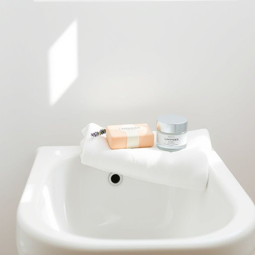

# facecloth

<h1 style="font-size: 2.5em; font-weight: 300; letter-spacing: 2px; margin: 0; color: #2c3e50;">
/facecloth*/
</h1>

---

---

## 例句

After finishing her skincare routine, she carefully folded the damp facecloth, which had been dipped in warm water to open up her pores, and placed it neatly on the edge of the sink alongside the lavender-scented soap and her favourite moisturizer.

*After(/ˈæftər/) finishing(/ˈfɪnɪʃɪŋ/) her(/hər/) skincare(/skincare*/) routine,(/ruˈtin,/) she(/ʃi/) carefully(/ˈkɛrfəli/) folded(/ˈfoʊldɪd/) the(/ðə/) damp(/dæmp/) facecloth,(/facecloth*,/) which(/wɪʧ/) had(/hæd/) been(/bɪn/) dipped(/dɪpt/) in(/ɪn/) warm(/wɔrm/) water(/ˈwɔtər/) to(/tɪ/) open(/ˈoʊpən/) up(/əp/) her(/hər/) pores,(/pɔrz,/) and(/ənd/) placed(/pleɪst/) it(/ɪt/) neatly(/ˈnitli/) on(/ɔn/) the(/ðə/) edge(/ɛʤ/) of(/əv/) the(/ðə/) sink(/sɪŋk/) alongside(/əˈlɔŋˈsaɪd/) the(/ðə/) lavender-scented(/lavender-scented*/) soap(/soʊp/) and(/ənd/) her(/hər/) favourite(/ˈfeɪvərɪt/) moisturizer.(/ˈmɔɪsʧərˌaɪzər./)*

**翻译：** 完成护肤程序后，她小心地将浸过温水、用于打开毛孔的湿毛巾叠好，整齐地放在洗手池边，旁边摆着薰衣草香皂和她最喜爱的保湿霜。

---

## 解释

英语单词facecloth作为名词，主要指家居生活用品中的洗脸布或面巾布，是一种用于清洁面部皮肤的小块布或毛巾，通常由棉质或类似柔软吸水的材料制成，适合日常洗脸和擦拭用途，使用场合一般是在浴室、卧室或旅行环境中，语境多见于描述个人卫生用品、洗漱用品清单或家庭日常清洁过程中；英语学习者在使用facecloth时需注意，该词为可数名词，复数形式为facecloths，常见搭配包括wash with a facecloth（用洗脸布洗脸）、a clean facecloth（一块干净的洗脸布）、moisten a facecloth（将洗脸布弄湿）等，在语法上符合普通可数名词的用法，既可单独使用，也可作为特定洗漱用品集合一部分出现；这个词起源于face（脸）与cloth（布料）的组合，直白地表达了其功能属性，反映了英语中复合名词构词的常见模式，起源可追溯至19世纪，用于明确区分专门用于脸部清洁的小布块；中文语境中，facecloth准确翻译为洗脸布或面巾布，是非常日常且中性的词汇，不含褒贬或特殊文化色彩，使用时应避免与大毛巾或浴巾等其他类似但功能范围不同的词混淆，其意义实用明确，且属于基本生活用品范畴，适合在家居、个人护理或旅行用品描述中使用。

---

<small style="color: #999; font-size: 0.9em;">2025-07-17 06:22:39</small>

