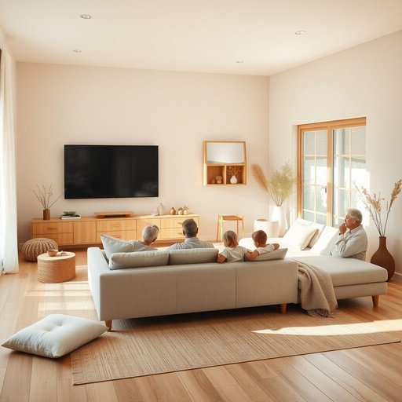

# family-room

<h1 style="font-size: 2.5em; font-weight: 300; letter-spacing: 2px; margin: 0; color: #2c3e50;">
/family-room*/
</h1>

---

---

## 例句

After a long day at work, we usually gather in the family-room, where the comfortable sofa, the large television, and the warm lighting create the perfect atmosphere for everyone, including the kids and grandparents, to unwind and enjoy some quality time together.

*After(/ˈæftər/) a(/ə/) long(/lɔŋ/) day(/deɪ/) at(/æt/) work,(/wərk,/) we(/wi/) usually(/ˈjuʒəwəli/) gather(/ˈgæðər/) in(/ɪn/) the(/ðə/) family-room,(/family-room*,/) where(/wɛr/) the(/ðə/) comfortable(/ˈkəmfərtəbəl/) sofa,(/ˈsoʊfə,/) the(/ðə/) large(/lɑrʤ/) television,(/ˈtɛləˌvɪʒən,/) and(/ənd/) the(/ðə/) warm(/wɔrm/) lighting(/ˈlaɪtɪŋ/) create(/kriˈeɪt/) the(/ðə/) perfect(/ˈpərˌfɪkt/) atmosphere(/ˈætməsˌfɪr/) for(/fər/) everyone,(/ˈɛvriˌwən,/) including(/ˌɪnˈkludɪŋ/) the(/ðə/) kids(/kɪdz/) and(/ənd/) grandparents,(/ˈgrændˌpɛrənts,/) to(/tɪ/) unwind(/ənˈwaɪnd/) and(/ənd/) enjoy(/ˌɛnˈʤɔɪ/) some(/səm/) quality(/kˈwɑləti/) time(/taɪm/) together.(/təˈgɛðər./)*

**翻译：** 一天忙碌工作结束后，我们通常会聚集在家庭活动室，舒适的沙发、大屏电视和温暖的灯光共同营造出完美的氛围，让包括孩子和祖父母在内的每个人都能放松身心，享受难得的美好时光。

---

## 解释

英语单词“family-room”作为名词在家居生活用品语境中专指住宅内为家庭成员共同休闲、娱乐或社交设计的一个功能性房间，通常比正式的客厅更为宽松和私密，常见于美式住宅布局中，适合一家人聚集看电视、聊天或玩游戏，使用场合多为家庭日常生活描述或房屋销售、装修设计相关对话。在语法上，“family-room”为复合名词，复合词中“family”作定语修饰“room”，英语学习者应注意复合名词整体作为单数名词使用时动词也应保持单数形式，常见搭配有“large family-room”（宽敞的家庭活动室）、“cozy family-room”（舒适的家庭室）、“family-room furniture”（家庭活动室家具）等，表达时可用形容词修饰，亦可与动词如“relax in the family-room”搭配。词源上，“family-room”源自“family”（家庭）与“room”（房间）的直接结合，反映的是对传统住宅空间功能划分的补充，随着20世纪中期美国家庭结构和居家生活方式的变化，这一词汇逐渐普及并固定下来，强调空间的非正式性和家庭成员间的亲密性交互。在中文语境中，“family-room”通常被准确翻译为“家庭活动室”或“家庭厅”，强调其作为住宅中专门供全家人使用的休闲空间的性质，区别于更正式的“客厅”；需避免简单译为“客厅”，以免忽视其更加休闲和私密的功能特点。该词汇本身无特殊褒贬含义，但体现了一种西方居家生活中强调家庭成员共同互动和舒适氛围的文化倾向，反映了住宅空间的功能多样化与私人化趋势。

---

<small style="color: #999; font-size: 0.9em;">2025-07-17 06:22:39</small>

