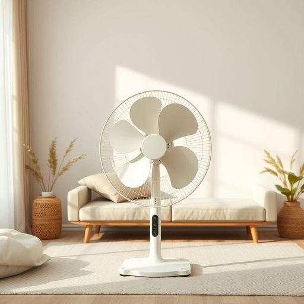

# fan

<h1 style="font-size: 2.5em; font-weight: 300; letter-spacing: 2px; margin: 0; color: #2c3e50;">
/fæn/
</h1>

---

---

## 例句

Although the phenomenon of oscillation in the ancient fan located in the living room, which has stubbornly refused to function properly since last summer, affects the cooling efficiency, I persist in using this fan during hot evenings instead of activating the noisy air conditioning unit that tends to cause dryness throughout the house.

*Although(/ˌɔlˈðoʊ/) the(/ðə/) phenomenon(/fəˈnɑməˌnɑn/) of(/əv/) oscillation(/ˌɑsəˈleɪʃən/) in(/ɪn/) the(/ðə/) ancient(/ˈeɪnʧənt/) fan(/fæn/) located(/ˈloʊˌkeɪtəd/) in(/ɪn/) the(/ðə/) living(/ˈlɪvɪŋ/) room,(/rum,/) which(/wɪʧ/) has(/həz/) stubbornly(/ˈstəbərnli/) refused(/rɪfˈjuzd/) to(/tɪ/) function(/ˈfəŋkʃən/) properly(/ˈprɑpərli/) since(/sɪns/) last(/læst/) summer,(/ˈsəmər,/) affects(/əˈfɛkts/) the(/ðə/) cooling(/ˈkulɪŋ/) efficiency,(/ɪˈfɪʃənsi,/) I(/aɪ/) persist(/pərˈsɪst/) in(/ɪn/) using(/ˈjuzɪŋ/) this(/ðɪs/) fan(/fæn/) during(/ˈdʊrɪŋ/) hot(/hɑt/) evenings(/ˈivnɪŋz/) instead(/ˌɪnˈstɛd/) of(/əv/) activating(/ˈæktəˌveɪtɪŋ/) the(/ðə/) noisy(/ˈnɔɪzi/) air(/ɛr/) conditioning(/kənˈdɪʃənɪŋ/) unit(/ˈjunɪt/) that(/ðət/) tends(/tɛndz/) to(/tɪ/) cause(/kɔz/) dryness(/ˈdraɪnəs/) throughout(/θruaʊt/) the(/ðə/) house.(/haʊs./)*

**翻译：** 虽然客厅里的那台古老风扇自去年夏天起便固执地无法正常运转，其摆动现象影响了制冷效果，但我仍坚持在炎热的夜晚使用它，而不是开启那台吵闹且容易使整个房间变得干燥的空调。

---

## 解释

英语单词“fan”作为名词在家居生活用品的语境中，通常指的是“风扇”，即用来产生空气流通以降温或透气的机械设备。具体使用场合多见于日常生活中，如客厅、卧室、办公室等室内环境，当需要改善空气流动或降低温度时，人们会提到“fan”，如桌面风扇（table fan）、吊扇（ceiling fan）和落地风扇（floor fan）等。英语学习者在使用“fan”时应注意其作为可数名词，需根据数量变化使用单复数形式fan或fans，在表达时常用的固定搭配有“turn on the fan”（打开风扇）、“switch off the fan”（关闭风扇）、“electric fan”（电风扇）等。此外，“fan”还可配合形容词表示类型，如“oscillating fan”（摆动风扇）、“portable fan”（便携风扇），这些搭配有助于准确描述具体产品。词源上，“fan”源自古英语“fann”，原意为扇子，后引申为机械设备产生风的装置，反映了这种器物从手摇扇到电动风扇的发展过程。在中文语境中，“fan”作为风扇的翻译非常准确，直接对应家用电器中的“风扇”，没有贬义或特殊褒义，属于中性词汇，常用于描述实际物品，帮助人们理解其功能和用途。需要注意的是，在英语中“fan”还有“迷、狂热爱好者”的含义，但在家居用品语境中应避免混淆，根据上下文判断，确保表达明确。总体而言，“fan”作为风扇的含义在家居生活中使用频繁，是基础词汇之一，理解和掌握其用法及搭配有助于英语学习者更自然地描述家居环境。

---

<small style="color: #999; font-size: 0.9em;">2025-07-17 06:22:39</small>

