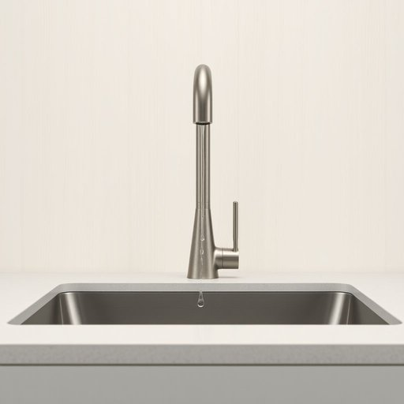

# faucet

<h1 style="font-size: 2.5em; font-weight: 300; letter-spacing: 2px; margin: 0; color: #2c3e50;">
/ˈfɔsət/
</h1>

---

---

## 例句

Could you please check if the faucet in the kitchen sink, which has been dripping steadily despite my attempts to tighten it, needs to be replaced or if there’s a simple fix to prevent the water wastage and the annoying noise it’s causing?

*Could(/kʊd/) you(/ju/) please(/pliz/) check(/ʧɛk/) if(/ɪf/) the(/ðə/) faucet(/ˈfɔsət/) in(/ɪn/) the(/ðə/) kitchen(/ˈkɪʧən/) sink,(/sɪŋk,/) which(/wɪʧ/) has(/həz/) been(/bɪn/) dripping(/ˈdrɪpɪŋ/) steadily(/ˈstɛdəli/) despite(/dɪˈspaɪt/) my(/maɪ/) attempts(/əˈtɛmpts/) to(/tɪ/) tighten(/ˈtaɪtən/) it,(/ɪt,/) needs(/nidz/) to(/tɪ/) be(/bi/) replaced(/ˌriˈpleɪst/) or(/ər/) if(/ɪf/) there’s(/there’s*/) a(/ə/) simple(/ˈsɪmpəl/) fix(/fɪks/) to(/tɪ/) prevent(/prɪˈvɛnt/) the(/ðə/) water(/ˈwɔtər/) wastage(/wastage*/) and(/ənd/) the(/ðə/) annoying(/əˈnɔɪɪŋ/) noise(/nɔɪz/) it’s(/it’s*/) causing?(/ˈkɔzɪŋ?/)*

**翻译：** 请您帮忙检查一下厨房水槽的水龙头，尽管我已经尝试拧紧，但它仍在持续滴水。不知道是否需要更换水龙头，还是有简单的方法可以防止水资源的浪费和由此产生的烦人噪音？

---

## 解释

英语单词“faucet”作为名词主要指家居生活中用于控制水流出水口的装置，多见于厨房水槽或浴室洗手盆等场合，通常指旋钮或把手可旋转或拨动以开关水流。英语学习者在使用“faucet”时应注意其作为可数名词用法，常见搭配有“turn on/off the faucet”（开/关水龙头）、“leaking faucet”（漏水的水龙头）等，此外，在美式英语中“faucet”更为常用，而英式英语中相应设备多称为“tap”，学习者需根据语境灵活选择。该词源自中古英语“faucet”，源于拉丁语“faux, faucis”，意为“喉咙”或“狭窄的通道”，形象地描述了水流通过的管口特征。在中文语境中，“faucet”一般准确翻译为“水龙头”，指安装在水管出口处用以控制水流的阀门装置，不带任何褒贬色彩，仅为功能性名词，文化上无特殊内涵或象征意义，使用时应注意与“tap”在不同英语变体中的偏好差异。

---

<small style="color: #999; font-size: 0.9em;">2025-07-17 06:22:39</small>

