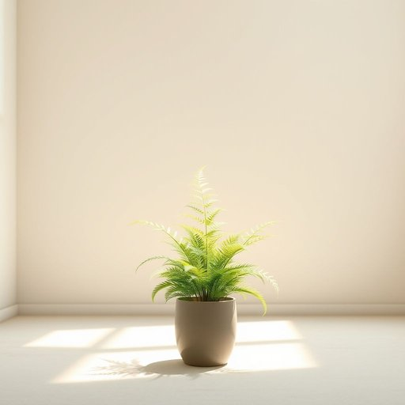

# fern

<h1 style="font-size: 2.5em; font-weight: 300; letter-spacing: 2px; margin: 0; color: #2c3e50;">
/fərn/
</h1>

---

---

## 例句

The fern, known for its delicate leaves and resilience, serves as a vital symbol of nature's ability to flourish even in the most unlikely indoor environments.

*The(/ðə/) fern,(/fərn,/) known(/noʊn/) for(/fər/) its(/ɪts/) delicate(/ˈdɛləkət/) leaves(/livz/) and(/ənd/) resilience,(/rɪˈzɪljəns,/) serves(/sərvz/) as(/ɛz/) a(/ə/) vital(/ˈvaɪtəl/) symbol(/ˈsɪmbəl/) of(/əv/) nature's(/ˈneɪʧərz/) ability(/əˈbɪləˌti/) to(/tɪ/) flourish(/flərɪʃ/) even(/ˈivɪn/) in(/ɪn/) the(/ðə/) most(/moʊst/) unlikely(/ənˈlaɪkli/) indoor(/ˈɪnˌdɔr/) environments.(/ɪnˈvaɪrənmənts./)*

**翻译：** Fern plants are known for their delicate leaves and strong vitality, becoming an important symbol of nature thriving even in the most unlikely indoor environments.

---

## 解释

英语单词“fern”作为名词在家居生活用品的语境中，通常指的是一种常见的蕨类植物，常用来装饰室内环境，如摆放在客厅、阳台或书房，以增添自然气息和美观效果。具体使用场合多出现在描述室内植物布置、园艺爱好或家居装饰时，例如“a fern in a pot”（一盆蕨类植物）常见于家居陈设说明中。英语学习者在使用该词时应注意，“fern”不可数时通常指蕨类植物这一类，但作具体植物时通常可数，如“a fern”。其常见搭配包括“potted fern”（盆栽蕨类）、“a patch of ferns”（一片蕨类植物）等，表达时常结合“grow”、“decorate with”、“water”等动词，强调植物的养护或装饰功能。词源上，“fern”源自古英语“fearn”，与古高地德语“farah”及古挪威语“farn”同根，指代一种古老的无花植物，直到现代仍保持这一含义，无褒贬色彩。中文中“fern”通常译为“蕨”或“蕨类植物”，准确体现其植物分类和形态特征，强调的是一种绿色观赏植物而非其他含义。其在家庭语境中多为中性词，既不带有特殊文化内涵，也不含积极或消极的情感色彩，仅作为家居绿植被人们喜爱和使用。

---

<small style="color: #999; font-size: 0.9em;">2025-07-17 06:22:39</small>

