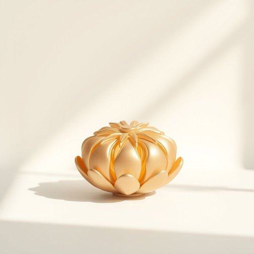

# figurine

<h1 style="font-size: 2.5em; font-weight: 300; letter-spacing: 2px; margin: 0; color: #2c3e50;">
/ˌfɪgjərˈin/
</h1>

---

---

## 例句

Despite the urgent need to finalize the complex project proposal before the deadline, which includes detailed financial forecasts and multiple stakeholder inputs, our team leader insisted that every aspect must be double-checked to ensure absolute accuracy and professionalism in the presentation.

*Despite(/dɪˈspaɪt/) the(/ðə/) urgent(/ˈərʤənt/) need(/nid/) to(/tɪ/) finalize(/ˈfaɪnəˌlaɪz/) the(/ðə/) complex(/ˈkɑmplɛks/) project(/ˈprɑʤɛkt/) proposal(/prəˈpoʊzəl/) before(/ˌbiˈfɔr/) the(/ðə/) deadline,(/ˈdɛˌdlaɪn,/) which(/wɪʧ/) includes(/ˌɪnˈkludz/) detailed(/dɪˈteɪld/) financial(/ˌfaɪˈnænʃəl/) forecasts(/ˈfɔrˌkæsts/) and(/ənd/) multiple(/ˈməltəpəl/) stakeholder(/ˈsteɪˌkhoʊldər/) inputs,(/ˈɪnˌpʊts,/) our(/ɑr/) team(/tim/) leader(/ˈlidər/) insisted(/ˌɪnˈsɪstɪd/) that(/ðət/) every(/ˈɛvəri/) aspect(/ˈæˌspɛkt/) must(/məst/) be(/bi/) double-checked(/double-checked*/) to(/tɪ/) ensure(/ɪnˈʃʊr/) absolute(/ˈæbsəˌlut/) accuracy(/ˈækjərəsi/) and(/ənd/) professionalism(/prəˈfɛʃənəˌlɪzəm/) in(/ɪn/) the(/ðə/) presentation.(/ˌprɛzənˈteɪʃən./)*

**翻译：** 尽管迫切需要在截止日期前完成这份包含详细财务预测和多方利益相关者意见的复杂项目提案，我们的团队负责人仍坚持每个环节都必须反复核查，以确保汇报的绝对准确性和专业水准。

---

## 解释

英语单词“figurine”在家居生活用品的语境中作为名词，通常指的是一种小型的人物或动物雕像，常用于装饰家居环境，如摆放在书架、茶几、展示柜等位置以增添艺术气息或个性化空间氛围。使用场合多见于描述装饰品、收藏品或礼品时，例如“a porcelain figurine”（瓷质小雕像）、“a decorative figurine”（装饰用小雕像）。英语学习者在使用“figurine”时需要注意其为可数名词，复数形式为“figurines”，且多用作具体物体名词，通常与形容词连用修饰其材质、风格或用途，常见搭配包括“porcelain figurine”、“ceramic figurine”、“antique figurine”等。语法上，“figurine”通常作为主语、宾语或表语出现，且多见于描述细节或装饰场景的句子中。在词源方面，“figurine”源自法语单词“figurine”，源自意大利语“figurina”，均源自拉丁语“figura”，意为“形状”或“形象”，这体现了其作为“小造型物”的本义。在中文语境中，“figurine”准确翻译为“小雕像”、“小摆件”、“小塑像”或“迷你雕塑”，强调的是其尺寸较小且具有装饰或收藏价值，区别于大型雕塑或实用品。该词本身没有特殊的褒贬色彩，但在文化内涵上，figurines往往被视作艺术品或收藏品，反映主人的审美趣味和文化品位，特别是在西方家庭中较为常见，用作表达艺术追求或纪念某种文化符号的象征。

---

<small style="color: #999; font-size: 0.9em;">2025-07-17 06:22:39</small>

