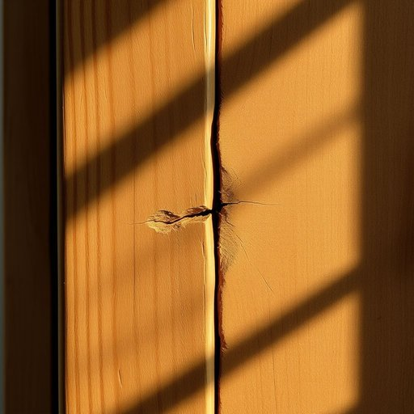

# filler

<h1 style="font-size: 2.5em; font-weight: 300; letter-spacing: 2px; margin: 0; color: #2c3e50;">
/ˈfɪlər/
</h1>

---

---

## 例句

When patching up the cracks in the old wooden cabinet, I made sure to apply a high-quality filler, which not only smoothed out the surface but also prevented further damage caused by dampness and drafts that tend to worsen during the colder months.

*When(/wɪn/) patching(/ˈpæʧɪŋ/) up(/əp/) the(/ðə/) cracks(/kræks/) in(/ɪn/) the(/ðə/) old(/oʊld/) wooden(/ˈwʊdən/) cabinet,(/ˈkæbənət,/) I(/aɪ/) made(/meɪd/) sure(/ʃʊr/) to(/tɪ/) apply(/əˈplaɪ/) a(/ə/) high-quality(/ˌhaɪkˈwɑləti/) filler,(/ˈfɪlər,/) which(/wɪʧ/) not(/nɑt/) only(/ˈoʊnli/) smoothed(/smuðd/) out(/aʊt/) the(/ðə/) surface(/ˈsərfəs/) but(/bət/) also(/ˈɔlsoʊ/) prevented(/prɪˈvɛnɪd/) further(/ˈfərðər/) damage(/ˈdæmɪʤ/) caused(/kɔzd/) by(/baɪ/) dampness(/ˈdæmpnɪs/) and(/ənd/) drafts(/dræfts/) that(/ðət/) tend(/tɛnd/) to(/tɪ/) worsen(/ˈwərsən/) during(/ˈdʊrɪŋ/) the(/ðə/) colder(/ˈkoʊldər/) months.(/mənθs./)*

**翻译：** 修补旧木橱柜的裂缝时，我特意选用了高质量的填料，这不仅让表面更加光滑，还有效防止了因寒冷季节湿气和冷风加剧而引发的进一步损害。

---

## 解释

在家居生活用品领域，英语单词“filler”作为名词通常指用于填充空间、缝隙或物体内部以增加体积、柔软度或稳定性的材料，比如沙发内的填充物、枕头的填充棉、或者家具内部填充泡沫等。具体使用场合多见于描述家具制造、床上用品或装修材料等情境中，如“The sofa has soft foam filler”（沙发有柔软的泡沫填充物）。学习者在使用“filler”时需注意其不可数名词用法，但在指具体类型或单位时可作为可数名词出现，如“a foam filler”。常见搭配包括“foam filler”，“polyester filler”，“cushion filler”等，表达时可结合材料性质。该词源自动词“fill”（填充），加上名词后缀“-er”，意为“填充物”或“用以填充的东西”，起源于英语的普通构词法，词义直接且形象，无明显褒贬色彩，文化内涵较为中性。在中文语境中，“filler”通常译为“填充物”或“填料”，强调其作为物理填充用途的功能，避免误解为语言中的“填充词”或美容中的“填充剂”，需根据具体家居语境准确理解，从而正确传递其作为实物材料的含义。

---

<small style="color: #999; font-size: 0.9em;">2025-07-17 06:22:39</small>

