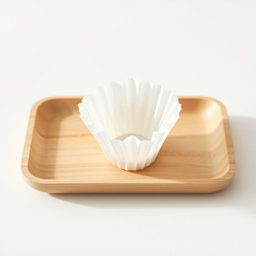

# filter

<h1 style="font-size: 2.5em; font-weight: 300; letter-spacing: 2px; margin: 0; color: #2c3e50;">
/ˈfɪltər/
</h1>

---

---

## 例句

Before you start brewing the coffee tomorrow morning, please remember to change the filter in the kettle, which has been clogged lately, because if it’s not replaced regularly, it might affect the taste and quality of the water.

*Before(/ˌbiˈfɔr/) you(/ju/) start(/stɑrt/) brewing(/bruɪŋ/) the(/ðə/) coffee(/ˈkɔfi/) tomorrow(/təˈmɑˌroʊ/) morning,(/ˈmɔrnɪŋ,/) please(/pliz/) remember(/rɪˈmɛmbər/) to(/tɪ/) change(/ʧeɪnʤ/) the(/ðə/) filter(/ˈfɪltər/) in(/ɪn/) the(/ðə/) kettle,(/ˈkɛtəl,/) which(/wɪʧ/) has(/həz/) been(/bɪn/) clogged(/klɔgd/) lately,(/ˈleɪtli,/) because(/bɪˈkəz/) if(/ɪf/) it’s(/it’s*/) not(/nɑt/) replaced(/ˌriˈpleɪst/) regularly,(/ˈrɛgjələrli,/) it(/ɪt/) might(/maɪt/) affect(/əˈfɛkt/) the(/ðə/) taste(/teɪst/) and(/ənd/) quality(/kˈwɑləti/) of(/əv/) the(/ðə/) water.(/ˈwɔtər./)*

**翻译：** 明天早晨开始煮咖啡之前，请记得更换水壶中的滤网，最近滤网已经堵塞。如果不定期更换，可能会影响水的口感和质量。

---

## 解释

在家居生活用品的语境中，英语单词“filter”作为名词通常指用于净化、过滤杂质或不纯物质的装置或材料，比如空气过滤器、净水滤芯、咖啡过滤器等。具体使用场合包括家用电器中的空气净化器滤网、饮用水净化系统中的滤芯，以及厨房用的咖啡过滤纸等。英语学习者在使用“filter”作为名词时需注意其可数性质，如a filter（一个滤器）、two filters（两个滤器），通常与动词“change”（更换）、“clean”（清洁）、“replace”（替换）等搭配较多，如change the filter（更换滤芯）。此外，filter常与water（滤水器）、air（滤空气器）、coffee（咖啡滤纸）等名词连用，表达具体滤除对象。该词源自拉丁语“filtrum”，意为“滤布”，最初指用于过滤液体的布料，后来泛指各种过滤装置，因此其历史背景与物理分离和净化过程密切相关。在中文语境中，“filter”对应“过滤器”、“滤芯”、“滤网”、“滤纸”等，根据具体器具有所区别，但核心意义均为“用于过滤杂质的器具”。该词在家居用品领域中无褒贬色彩，属于中性词汇，表达功能性和实用性，反映了现代生活中对空气、水质及食品安全的关注。

---

<small style="color: #999; font-size: 0.9em;">2025-07-17 06:22:39</small>

