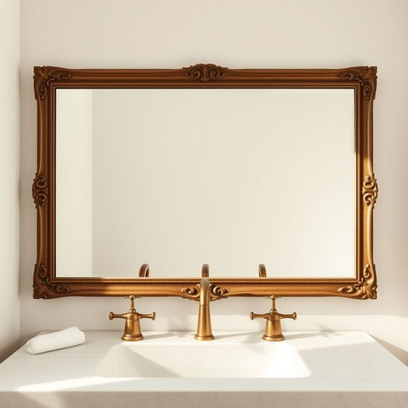

# fixture

<h1 style="font-size: 2.5em; font-weight: 300; letter-spacing: 2px; margin: 0; color: #2c3e50;">
/ˈfɪksʧər/
</h1>

---

---

## 例句

Before we finalise the renovation plans, we need to decide whether to replace the bathroom fixture, which includes the vintage brass taps and the ornate mirror frame, or simply restore them to maintain the house’s original charm.

*Before(/ˌbiˈfɔr/) we(/wi/) finalise(/finalise*/) the(/ðə/) renovation(/ˌrɛnəˈveɪʃən/) plans,(/plænz,/) we(/wi/) need(/nid/) to(/tɪ/) decide(/ˌdɪˈsaɪd/) whether(/ˈwɛðər/) to(/tɪ/) replace(/ˌriˈpleɪs/) the(/ðə/) bathroom(/ˈbæθˌrum/) fixture,(/ˈfɪksʧər,/) which(/wɪʧ/) includes(/ˌɪnˈkludz/) the(/ðə/) vintage(/ˈvɪntɪʤ/) brass(/bræs/) taps(/tæps/) and(/ənd/) the(/ðə/) ornate(/ɔrˈneɪt/) mirror(/ˈmɪrər/) frame,(/freɪm,/) or(/ər/) simply(/ˈsɪmpli/) restore(/rɪˈstɔr/) them(/ðɛm/) to(/tɪ/) maintain(/meɪnˈteɪn/) the(/ðə/) house’s(/house’s*/) original(/ərˈɪʤənəl/) charm.(/ʧɑrm./)*

**翻译：** 在最终确定装修方案之前，我们需要决定是更换浴室的装置（包括复古的黄铜水龙头和精致的镜框），还是仅对其进行修复，以保留房屋原有的魅力。

---

## 解释

英语单词"fixture"在家居生活用品语境中，作为名词主要指固定安装在建筑物内的设备或装置，如灯具、浴室设备、橱柜或固定的管道装置，通常是房屋结构的一部分，不能轻易拆卸或移动。使用时多见于描述房屋内部的固定配置，如“lighting fixtures”（灯具）、“bathroom fixtures”（浴室设备）等。英语学习者需要注意，"fixture"多用于复数形式"fixtures"表示各种固定装置，且常与形容词连用，如"built-in fixtures"（内置固定装置）或"permanent fixtures"（永久固定装置）。语法上，"fixture"是可数名词，且其意义不同于"furniture"（家具，较易拆卸移动）；表达时要区分清楚。该词源自拉丁语"figura"意为“形状、固定”，通过古法语"fixer"意为“固定”，反映其“固定不动物品”的本质。中文语境中，"fixture"应准确理解为“固定装置”或“固定器具”，强调其不可轻易拆卸的特性，区别于“家具”或“摆设”。该词在家居生活领域较为中性，既无明显褒义也无贬义，但在法律或房产交易中，"fixture"的定义关系到物品归属权，具有一定法律和经济含义，需根据具体语境理解。

---

<small style="color: #999; font-size: 0.9em;">2025-07-17 06:22:39</small>

