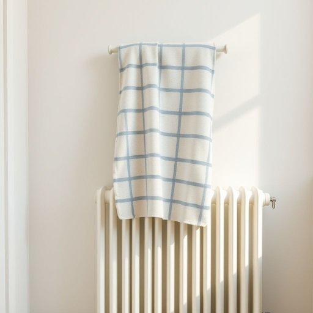

# flannel

<h1 style="font-size: 2.5em; font-weight: 300; letter-spacing: 2px; margin: 0; color: #2c3e50;">
/ˈflænəl/
</h1>

---

---

## 例句

Could you please pass me the flannel that's hanging over the radiator in the bathroom, the one with the faded blue stripes, since my hands are still a bit dirty after gardening and I want to make sure I clean them thoroughly before coming to dinner?

*Could(/kʊd/) you(/ju/) please(/pliz/) pass(/pæs/) me(/mi/) the(/ðə/) flannel(/ˈflænəl/) that's(/ðæts/) hanging(/ˈhæŋɪŋ/) over(/ˈoʊvər/) the(/ðə/) radiator(/ˈreɪdiˌeɪtər/) in(/ɪn/) the(/ðə/) bathroom,(/ˈbæθˌrum,/) the(/ðə/) one(/wən/) with(/wɪθ/) the(/ðə/) faded(/ˈfeɪdɪd/) blue(/blu/) stripes,(/straɪps,/) since(/sɪns/) my(/maɪ/) hands(/hænz/) are(/ər/) still(/stɪl/) a(/ə/) bit(/bɪt/) dirty(/ˈdərti/) after(/ˈæftər/) gardening(/ˈgɑrdənɪŋ/) and(/ənd/) I(/aɪ/) want(/wɔnt/) to(/tɪ/) make(/meɪk/) sure(/ʃʊr/) I(/aɪ/) clean(/klin/) them(/ðɛm/) thoroughly(/ˈθəroʊli/) before(/ˌbiˈfɔr/) coming(/ˈkəmɪŋ/) to(/tɪ/) dinner?(/ˈdɪnər?/)*

**翻译：** 你能把浴室暖气片上挂着的那条法兰绒毛巾递给我吗？就是那条带有褪色蓝色条纹的，因为我刚做完园艺，手还有些脏，想在吃饭前好好洗干净。

---

## 解释

英语单词“flannel”作为名词，在家居生活用品的语境中通常指一种柔软、略带绒毛质感的棉织或羊毛织物，常用于制作睡衣、床单、毛巾、手帕或擦拭布，因其保暖且触感舒适而广受欢迎。具体使用场合多见于描述家庭卧室或浴室用品时，如“a flannel sheet”（法兰绒床单）或“a face flannel”（面巾）。英语学习者在使用时需注意，“flannel”既可指布料也可指用该布料制成的具体物品，且其复数形式为“flannels”，表示多条这类织物制品；此外，“flannel”作为不可数名词时强调材质，作为可数名词时侧重具体物件。常见搭配包括“flannel shirt”（法兰绒衬衫）、“flannel pajamas”（法兰绒睡衣）和“flannel cloth”（法兰绒布）。词源上，“flannel”源自威尔士语“gwlanen”，意为“羊毛制品”，传入英语后演变为现今含义，反映其原始作为羊毛柔软织物的属性。在中文语境中，“flannel”被准确翻译为“法兰绒”，强调其柔软绒毛的质地及保暖特性，无褒贬色彩，属于中性词汇，且因其材质经常用于冬季保暖用品，带有温馨舒适的生活用具色彩。文化上，法兰绒因其历史悠久和实用性强，深受欧美家庭喜爱，常与居家温暖、休闲时光联系在一起。

---

<small style="color: #999; font-size: 0.9em;">2025-07-17 06:22:39</small>

