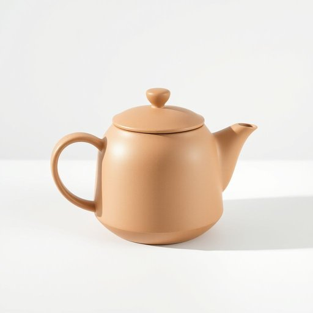

# flask

<h1 style="font-size: 2.5em; font-weight: 300; letter-spacing: 2px; margin: 0; color: #2c3e50;">
/flæsk/
</h1>

---

---

## 例句

Could you please pass me the insulated flask from the kitchen cupboard, which has a slightly scratched lid and keeps tea hot for hours, because I want to fill the flask before heading out for the afternoon walk in the chilly weather?

*Could(/kʊd/) you(/ju/) please(/pliz/) pass(/pæs/) me(/mi/) the(/ðə/) insulated(/ˈɪnsəˌleɪtɪd/) flask(/flæsk/) from(/frəm/) the(/ðə/) kitchen(/ˈkɪʧən/) cupboard,(/ˈkəbərd,/) which(/wɪʧ/) has(/həz/) a(/ə/) slightly(/sˈlaɪtli/) scratched(/skræʧt/) lid(/lɪd/) and(/ənd/) keeps(/kips/) tea(/ti/) hot(/hɑt/) for(/fər/) hours,(/aʊərz,/) because(/bɪˈkəz/) I(/aɪ/) want(/wɔnt/) to(/tɪ/) fill(/fɪl/) the(/ðə/) flask(/flæsk/) before(/ˌbiˈfɔr/) heading(/ˈhɛdɪŋ/) out(/aʊt/) for(/fər/) the(/ðə/) afternoon(/ˌæftərˈnun/) walk(/wɔk/) in(/ɪn/) the(/ðə/) chilly(/ˈʧɪli/) weather?(/ˈwɛðər?/)*

**翻译：** 您能帮我从厨房橱柜里拿一下那个盖子上有轻微刮痕的保温瓶吗？它能长时间保持茶水的温热，我想在寒冷的天气下午散步前把茶倒进去。

---

## 解释

单词“flask”作为名词在家居生活用品的语境中，通常指一种小巧便携的容器，用来盛装液体，最常见的是指随身携带的金属或玻璃制酒壶（通常用于装烈酒）。具体使用场合多见于户外活动、旅行、聚会等场景中，供个人随身携带饮用液体之用。英语学习者使用“flask”时需注意它是可数名词，常见搭配有“a hip flask”（贴身酒壶）、“a vacuum flask”或“thermos flask”（保温瓶），后者用于保温热饮或冷饮。在语法上，“flask”作为名词通常作主语、宾语或同位语使用，复数形式为“flasks”。词源上，“flask”源自中古英语，进入英语使用自14世纪，源自古法语“flaske”，指小瓶子，进而演变为现代含义。中文语境中，“flask”通常准确翻译为“酒壶”或“保温瓶”，具体含义需结合上下文辨别。该词本身无褒贬色彩，但“flask”作为便携酒壶在文化上有时含有隐秘饮酒或私藏酒精的含义，因而在某些场合可能带有轻微的非正式或私密色彩。总体而言，“flask”在家居用品分类中是一种实用且常见的液体容器，理解其多样用法有助于准确表达。

---

<small style="color: #999; font-size: 0.9em;">2025-07-17 06:22:39</small>

