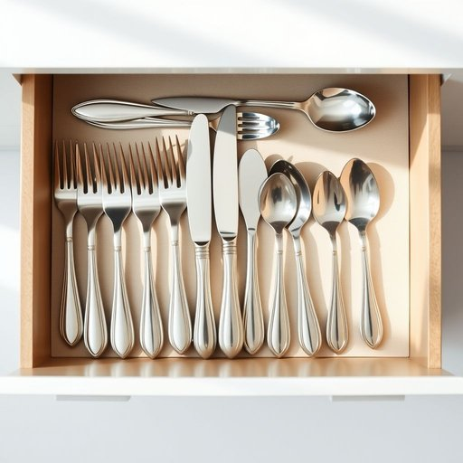

# flatware

<h1 style="font-size: 2.5em; font-weight: 300; letter-spacing: 2px; margin: 0; color: #2c3e50;">
/ˈflætˌwɛr/
</h1>

---

---

## 例句

Before setting the dining table for tonight’s dinner party, could you please check if the flatware, including the polished forks, knives, and spoons we inherited from Grandma, has been properly cleaned and arranged in the drawers to ensure everything matches the elegant place settings?

*Before(/ˌbiˈfɔr/) setting(/ˈsɛtɪŋ/) the(/ðə/) dining(/ˈdaɪnɪŋ/) table(/ˈteɪbəl/) for(/fər/) tonight’s(/tonight’s*/) dinner(/ˈdɪnər/) party,(/ˈpɑrti,/) could(/kʊd/) you(/ju/) please(/pliz/) check(/ʧɛk/) if(/ɪf/) the(/ðə/) flatware,(/ˈflætˌwɛr,/) including(/ˌɪnˈkludɪŋ/) the(/ðə/) polished(/ˈpɑlɪʃt/) forks,(/fɔrks,/) knives,(/naɪvz,/) and(/ənd/) spoons(/spunz/) we(/wi/) inherited(/ˌɪnˈhɛrətɪd/) from(/frəm/) Grandma,(/ˈgrændmɑ,/) has(/həz/) been(/bɪn/) properly(/ˈprɑpərli/) cleaned(/klind/) and(/ənd/) arranged(/əreɪnʤd/) in(/ɪn/) the(/ðə/) drawers(/drɔrz/) to(/tɪ/) ensure(/ɪnˈʃʊr/) everything(/ˈɛvriˌθɪŋ/) matches(/ˈmæʧɪz/) the(/ðə/) elegant(/ˈɛləgənt/) place(/pleɪs/) settings?(/ˈsɛtɪŋz?/)*

**翻译：** 在布置今晚晚宴的餐桌之前，能否请你检查一下我们从奶奶那里继承的餐具——包括擦拭光亮的叉子、刀子和勺子——是否已被妥善清洗并整齐地摆放在抽屉里，确保一切都与优雅的餐具摆设相匹配？

---

## 解释

英语单词"flatware"在家居生活用品语境中作为名词，通常指餐桌上使用的金属餐具，包括刀、叉、勺等，用于进食和就餐。具体使用场合多见于描述餐具配置、餐厅或家庭餐具的分类时，如“Please set the table with the flatware”（请摆好餐具）。英语学习者在使用“flatware”时要注意其复数形式一般保持不变，通常视为集合名词，常与“set”（套装）、“silverware”（银餐具）、“cutlery”（刀叉餐具）等词搭配使用，但“flatware”侧重指平整的餐具整体而不限于单件；语法上多作不可数名词出现，也可用作可数名词指一套或一件餐具。词源上，“flatware”由“flat”（平的）和“ware”（器物）组成，起源于19世纪，强调这些餐具多为平制金属器具，区别于陶瓷或玻璃器皿。在中文语境中，“flatware”准确翻译为“餐具”，但更侧重指刀叉勺这类金属餐具，而非碗碟，理解时应避免与“餐具”泛指的陶瓷、玻璃器皿混淆。该词本身无褒贬色彩，是中性词，但在文化上常与西式餐桌礼仪相关联，体现餐桌规范和精致生活的含义。

---

<small style="color: #999; font-size: 0.9em;">2025-07-17 06:22:39</small>

