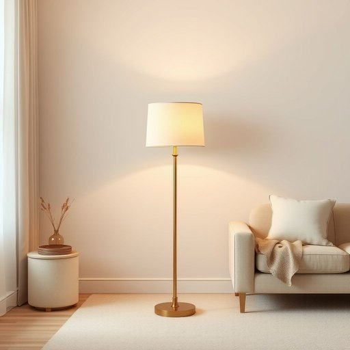

# floor-lamp

<h1 style="font-size: 2.5em; font-weight: 300; letter-spacing: 2px; margin: 0; color: #2c3e50;">
/floor-lamp*/
</h1>

---

---

## 例句

In the cozy corner of the living room, the floor-lamp, featuring a brass stand and a soft, cream-coloured shade, cast a warm, inviting glow that made late-night reading genuinely pleasurable.

*In(/ɪn/) the(/ðə/) cozy(/ˈkoʊzi/) corner(/ˈkɔrnər/) of(/əv/) the(/ðə/) living(/ˈlɪvɪŋ/) room,(/rum,/) the(/ðə/) floor-lamp,(/floor-lamp*,/) featuring(/ˈfiʧərɪŋ/) a(/ə/) brass(/bræs/) stand(/stænd/) and(/ənd/) a(/ə/) soft,(/sɔft,/) cream-coloured(/cream-coloured*/) shade,(/ʃeɪd,/) cast(/kæst/) a(/ə/) warm,(/wɔrm,/) inviting(/ˌɪnˈvaɪtɪŋ/) glow(/gloʊ/) that(/ðət/) made(/meɪd/) late-night(/ˈleɪtˌnaɪt/) reading(/ˈrɛdɪŋ/) genuinely(/ˈʤɛnjuˌaɪnli/) pleasurable.(/ˈplɛʒərəbəl./)*

**翻译：** 在客厅温馨的角落里，那盏配有黄铜灯座和柔和奶油色灯罩的落地灯散发出温暖而宜人的光芒，使夜读时光格外惬意。

---

## 解释

floor-lamp作为名词，指的是一种落地灯，常见于家居生活中，用于提供环境照明或局部照明，适合置于客厅、卧室或书房等空间。使用场合多为需要柔和光线或装饰性灯具的场合，既实用又能增添室内氛围。英语学习者在使用floor-lamp时需注意其构成是复合名词，floor修饰lamp，整体作单数时表示单一的落地灯；复数形式为floor-lamps。常见搭配有turn on/off the floor-lamp（打开/关掉落地灯）、adjust the floor-lamp height（调节落地灯高度）等。在表达时可与其它家具或照明设备连用，如a corner floor-lamp（角落的落地灯）。词源方面，floor来源于中古英语，意指地板，lamp意指灯具，合成词floor-lamp便是指直置于地面的灯具，起源于欧美家庭照明文化，强调其实用和稳定性。中文中准确翻译为“落地灯”，直接对应该灯具的形态和用途，无特殊贬义或褒义，属于中性词汇，文化内涵主要体现在现代家居设计中的装饰与功能价值，因其常作为室内美学和氛围营造的重要元素而被广泛使用。

---

<small style="color: #999; font-size: 0.9em;">2025-07-17 06:22:39</small>

