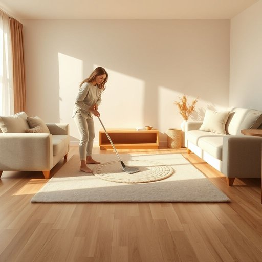

# floor

<h1 style="font-size: 2.5em; font-weight: 300; letter-spacing: 2px; margin: 0; color: #2c3e50;">
/flɔr/
</h1>

---

---

## 例句

After accidentally spilling the tea on the wooden floor, she quickly grabbed a mop and, while carefully avoiding the newly laid carpet in the living room, started cleaning up the mess before it could leave any stubborn stains.

*After(/ˈæftər/) accidentally(/ˌæksəˈdɛnəli/) spilling(/ˈspɪlɪŋ/) the(/ðə/) tea(/ti/) on(/ɔn/) the(/ðə/) wooden(/ˈwʊdən/) floor,(/flɔr,/) she(/ʃi/) quickly(/kˈwɪkli/) grabbed(/græbd/) a(/ə/) mop(/mɑp/) and,(/ənd,/) while(/waɪl/) carefully(/ˈkɛrfəli/) avoiding(/əˈvɔɪdɪŋ/) the(/ðə/) newly(/ˈnuli/) laid(/leɪd/) carpet(/ˈkɑrpət/) in(/ɪn/) the(/ðə/) living(/ˈlɪvɪŋ/) room,(/rum,/) started(/ˈstɑrtɪd/) cleaning(/ˈklinɪŋ/) up(/əp/) the(/ðə/) mess(/mɛs/) before(/ˌbiˈfɔr/) it(/ɪt/) could(/kʊd/) leave(/liv/) any(/ˈɛni/) stubborn(/ˈstəbərn/) stains.(/steɪnz./)*

**翻译：** 不小心将茶水洒在木地板上后，她迅速拿起拖把，小心避开客厅中新铺的地毯，开始清理洒落的茶水，以免留下顽固的污渍。

---

## 解释

英语单词floor作为名词在家居生活用品语境中，主要指室内建筑物最底层的水平面，即人们站立、行走的地面，通常由木板、瓷砖、地毯等材料构成。具体使用场合多见于描述房间结构、家居布局或清洁打扫等场景，如the kitchen floor（厨房地板）或clean the floor（擦地）。英语学习者使用该词时应注意其单数和复数形式，复数为floors，指建筑物的层数；同时，floor还可指房间内的地面，这时不能与ground混淆，后者多指户外地面。另外，常见搭配有floor mat（地垫）、wooden floor（木地板）、floor covering（地面覆盖物）等，表达时应准确区分floor指地面还是story/floor指楼层。词源来自中古英语flour或flor，源于拉丁语plānum，意为平坦的地方，反映其作为平坦表面的本义。在中文中，floor在家居语境中多译为地板或地面，强调其作为室内人们活动的水平面，准确理解时应根据上下文区分是指地板的材质层面还是建筑层数。一般而言，floor无特殊褒贬含义，属于中性词汇，在文化上没有明显色彩，只是在建筑、设计或打扫清理等生活语境中高频使用，体现其日常生活的重要性。

---

<small style="color: #999; font-size: 0.9em;">2025-07-17 06:22:39</small>

