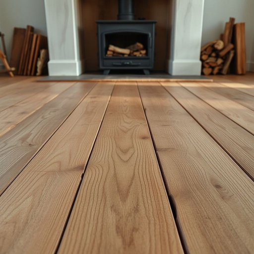

# floorboard

<h1 style="font-size: 2.5em; font-weight: 300; letter-spacing: 2px; margin: 0; color: #2c3e50;">
/ˈflɔrˌbɔrd/
</h1>

---

---

## 例句

Although the old floorboard near the fireplace creaked ominously every time someone stepped on it, we decided not to replace it immediately, hoping that with a bit of careful sanding and varnishing, it would restore the rustic charm of the living room without losing its historical character.

*Although(/ˌɔlˈðoʊ/) the(/ðə/) old(/oʊld/) floorboard(/ˈflɔrˌbɔrd/) near(/nɪr/) the(/ðə/) fireplace(/ˈfaɪərˌpleɪs/) creaked(/krikt/) ominously(/ˈɑmənəsli/) every(/ˈɛvəri/) time(/taɪm/) someone(/ˈsəmˌwən/) stepped(/stɛpt/) on(/ɔn/) it,(/ɪt,/) we(/wi/) decided(/ˌdɪˈsaɪdɪd/) not(/nɑt/) to(/tɪ/) replace(/ˌriˈpleɪs/) it(/ɪt/) immediately,(/ˌɪˈmiˌdiətli,/) hoping(/ˈhoʊpɪŋ/) that(/ðət/) with(/wɪθ/) a(/ə/) bit(/bɪt/) of(/əv/) careful(/ˈkɛrfəl/) sanding(/ˈsændɪŋ/) and(/ənd/) varnishing,(/varnishing*,/) it(/ɪt/) would(/wʊd/) restore(/rɪˈstɔr/) the(/ðə/) rustic(/ˈrəstɪk/) charm(/ʧɑrm/) of(/əv/) the(/ðə/) living(/ˈlɪvɪŋ/) room(/rum/) without(/wɪˈθaʊt/) losing(/ˈluzɪŋ/) its(/ɪts/) historical(/hɪˈstɔrɪkəl/) character.(/ˈkɛrɪktər./)*

**翻译：** 虽然壁炉旁的旧地板每次有人踩上去时都会发出不祥的吱吱声，但我们决定暂不更换，希望通过细心的打磨和上漆，能够恢复客厅的质朴魅力，同时保留其独特的历史韵味。

---

## 解释

“floorboard”作为名词，主要指铺设地板的木板，常见于描述家居装修或维护场景中，例如谈论房间地面结构时会提到floorboard的安装、修理或更换。英语学习者在使用该词时应注意其复数形式为“floorboards”，且通常与动词搭配时多用复数，常见搭配有“lift the floorboard”（掀起地板板块）、“creaky floorboards”（吱吱作响的地板木板）等，此外，通过上下文也可衍生出具体情境，如“under the floorboard”用来暗示藏匿或隐藏某物。词源上，“floorboard”由“floor”（地板）和“board”（板木）组合而成，源自中世纪英语中的“board”指木板，反映出其字面含义和实用功能。在中文语境中，floorboard准确翻译为“地板板块”或“地板木板”，强调是地面铺装的组成部分，区别于整体“地板”一词强调整体铺设面，其含义中性无褒贬色彩，属于常见的家居用语，文化层面无特别隐喻或象征意义。

---

<small style="color: #999; font-size: 0.9em;">2025-07-17 06:22:39</small>

