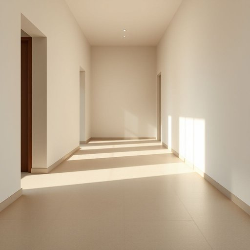

# flooring

<h1 style="font-size: 2.5em; font-weight: 300; letter-spacing: 2px; margin: 0; color: #2c3e50;">
/ˈflɔrɪŋ/
</h1>

---

---

## 例句

Considering the damp conditions in our hallway, which often cause the flooring to become slippery and wear out faster than usual, we decided to invest in a durable, water-resistant vinyl flooring that not only complements the overall décor but also requires minimal maintenance over the years.

*Considering(/kənˈsɪdərɪŋ/) the(/ðə/) damp(/dæmp/) conditions(/kənˈdɪʃənz/) in(/ɪn/) our(/ɑr/) hallway,(/ˈhɔlˌweɪ,/) which(/wɪʧ/) often(/ˈɔfən/) cause(/kɔz/) the(/ðə/) flooring(/ˈflɔrɪŋ/) to(/tɪ/) become(/bɪˈkəm/) slippery(/sˈlɪpəri/) and(/ənd/) wear(/wɛr/) out(/aʊt/) faster(/ˈfæstər/) than(/ðən/) usual,(/ˈjuʒəwəl,/) we(/wi/) decided(/ˌdɪˈsaɪdɪd/) to(/tɪ/) invest(/ˌɪnˈvɛst/) in(/ɪn/) a(/ə/) durable,(/ˈdʊrəbəl,/) water-resistant(/water-resistant*/) vinyl(/ˈvaɪnəl/) flooring(/ˈflɔrɪŋ/) that(/ðət/) not(/nɑt/) only(/ˈoʊnli/) complements(/ˈkɑmpləmənts/) the(/ðə/) overall(/ˈoʊvərˌɔl/) décor(/décor*/) but(/bət/) also(/ˈɔlsoʊ/) requires(/rikˈwaɪərz/) minimal(/ˈmɪnəməl/) maintenance(/ˈmeɪntənəns/) over(/ˈoʊvər/) the(/ðə/) years.(/jɪrz./)*

**翻译：** 考虑到我们走廊潮湿的环境，这常导致地板变得滑腻且磨损速度较平时更快，我们决定选用一种耐用且防水的乙烯基地板。这种地板不仅与整体装修风格相得益彰，还能在多年使用过程中保持维护简便。

---

## 解释

英语单词“flooring”作为名词在家居生活用品领域，通常指用于覆盖地面或地板的材料，如木地板、瓷砖、地毯、复合地板等，常见于装修、建筑或室内设计的语境中，比如在购买或安装地板时会用到这一词汇。学习者使用“flooring”时需注意其不可数名词性质，通常不直接用复数形式，且与之搭配的常见表达有“wood flooring”（木地板）、“vinyl flooring”（乙烯基地板）、“flooring installation”（地板安装）、“flooring materials”（地板材料）等，此外表示安装或更换地板时多用“install flooring”或“lay flooring”结构。词源方面，“flooring”来源于动词“floor”的名词化形式，原指铺设地板的动作或过程，后来转为指地面覆盖材料本身。“floor”一词源自古英语“flōr”，意味着地面或房间内可步行的表面，具有悠久使用历史。在中文语境中，“flooring”准确译为“地板材料”或“地板”，侧重指作为装修用的地面覆盖物，与“地板”本身或地面结构相关，区别于“floors”泛指楼层或层数。该词无特殊褒贬含义，语言色彩中性，广泛应用于家庭装修、建筑设计及相关行业，体现实用和技术层面内容。

---

<small style="color: #999; font-size: 0.9em;">2025-07-17 06:22:39</small>

