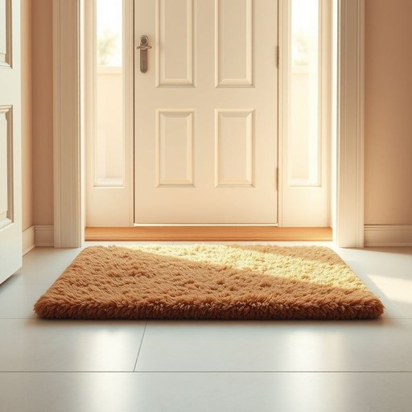

# floormat

<h1 style="font-size: 2.5em; font-weight: 300; letter-spacing: 2px; margin: 0; color: #2c3e50;">
/floormat*/
</h1>

---

---

## 例句

Before guests arrive, could you please replace the old, worn-out floormat at the front door with the new one we bought last weekend, which not only has a thicker pile to trap dirt more effectively but also features a waterproof backing that prevents water from seeping through onto the floorboards?

*Before(/ˌbiˈfɔr/) guests(/gɛsts/) arrive,(/əraɪv,/) could(/kʊd/) you(/ju/) please(/pliz/) replace(/ˌriˈpleɪs/) the(/ðə/) old,(/oʊld,/) worn-out(/worn-out*/) floormat(/floormat*/) at(/æt/) the(/ðə/) front(/frənt/) door(/dɔr/) with(/wɪθ/) the(/ðə/) new(/nu/) one(/wən/) we(/wi/) bought(/bɔt/) last(/læst/) weekend,(/ˈwiˌkɪnd,/) which(/wɪʧ/) not(/nɑt/) only(/ˈoʊnli/) has(/həz/) a(/ə/) thicker(/ˈθɪkər/) pile(/paɪl/) to(/tɪ/) trap(/træp/) dirt(/dərt/) more(/mɔr/) effectively(/ˈifɛktɪvli/) but(/bət/) also(/ˈɔlsoʊ/) features(/ˈfiʧərz/) a(/ə/) waterproof(/ˈwɔtərˌpruf/) backing(/ˈbækɪŋ/) that(/ðət/) prevents(/prɪˈvɛnts/) water(/ˈwɔtər/) from(/frəm/) seeping(/ˈsipɪŋ/) through(/θru/) onto(/ˈɔntu/) the(/ðə/) floorboards?(/ˈflɔrˌbɔrdz?/)*

**翻译：** 在客人到来之前，能否请您将前门处那块旧且磨损的门垫换成我们上周末买的新款？这款门垫不仅绒毛更厚，更能有效拦截污垢，而且具有防水底层，能防止水渗透到地板上。

---

## 解释

英语单词"floormat"作为名词，指的是放置在地板上用以保护地面或清洁鞋底的垫子，常见于家庭门口、浴室入口或厨房等位置，具体使用场合通常是防止尘土、泥水带入室内，保持地面清洁。有时也用来提供脚踏的舒适感或防滑效果。英语学习者在使用"floormat"时应注意它是可数名词，通常与冠词连用，如"a floormat"或"the floormat"，常见搭配有"door floormat"（门口垫）、"bathroom floormat"（浴室垫）、"rubber floormat"（橡胶地垫）等，且该词构成较为直接，"floor"和"mat"组合而成，语法上无复杂变化。词源方面，"floormat"由"floor"（地板）和"mat"（垫子）合成，是一种复合名词，起源简单，直观表述其功能，词义清晰实用。在中文语境中，"floormat"通常译为“地垫”或“门口垫”，根据具体用途也称为“门垫”或“浴室垫”，强调其铺设于地面上的实用性和保护性，词义无特殊褒贬含义，属于中性且常见的生活用品词汇，使用时符合普通家居环境描述，没有特殊文化内涵。

---

<small style="color: #999; font-size: 0.9em;">2025-07-17 06:22:39</small>

