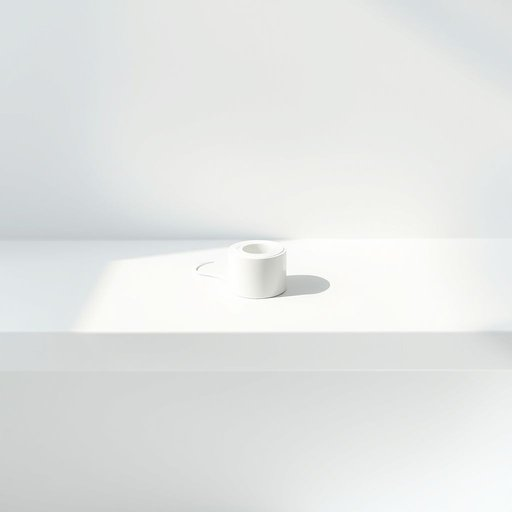

# floss

<h1 style="font-size: 2.5em; font-weight: 300; letter-spacing: 2px; margin: 0; color: #2c3e50;">
/flɑs/
</h1>

---

---

## 例句

Before you head to bed, don’t forget to grab the floss from the bathroom cabinet, especially the mint-flavored one we bought last week, as it’s much more effective at removing the stubborn bits stuck between your teeth after dinner than just brushing alone.

*Before(/ˌbiˈfɔr/) you(/ju/) head(/hɛd/) to(/tɪ/) bed,(/bɛd,/) don’t(/don’t*/) forget(/fərˈgɛt/) to(/tɪ/) grab(/græb/) the(/ðə/) floss(/flɑs/) from(/frəm/) the(/ðə/) bathroom(/ˈbæθˌrum/) cabinet,(/ˈkæbənət,/) especially(/əˈspɛʃəli/) the(/ðə/) mint-flavored(/mint-flavored*/) one(/wən/) we(/wi/) bought(/bɔt/) last(/læst/) week,(/wik,/) as(/ɛz/) it’s(/it’s*/) much(/məʧ/) more(/mɔr/) effective(/ˈifɛktɪv/) at(/æt/) removing(/riˈmuvɪŋ/) the(/ðə/) stubborn(/ˈstəbərn/) bits(/bɪts/) stuck(/stək/) between(/bɪtˈwin/) your(/jʊr/) teeth(/tiθ/) after(/ˈæftər/) dinner(/ˈdɪnər/) than(/ðən/) just(/ʤɪst/) brushing(/ˈbrəʃɪŋ/) alone.(/əˈloʊn./)*

**翻译：** 睡前别忘了从浴室橱柜里拿牙线，尤其是我们上周买的薄荷味牙线，因为它在清除晚餐后粘在牙缝里的顽固残渣方面，比单纯刷牙效果好多了。

---

## 解释

英语单词“floss”作为名词在家居生活用品的语境中，主要指的是“牙线”，即用于清洁牙齿间隙的细线状清洁工具，常见于日常口腔卫生护理场合，如刷牙之后使用以去除牙缝间的食物残渣和牙菌斑。英语学习者在使用“floss”作为名词时，应注意其是可数名词，常见搭配有“dental floss”（牙线）、“use floss”（用牙线）以及“floss picks”（牙线棒）；此外，“floss”作为名词时通常置于名词前作定语，如“一段牙线”。语法上，“floss”作为名词不用于复数形式表达牙线的数量，一般以不可数名词出现，但可用计量词分割。它的词源来自中古英语，源自古法语“floche”，意指柔软的纤维束，最初可能指绣花用的丝线，后来引申为细而柔软的线，适合清洁牙齿。中文语境中“floss”准确翻译为“牙线”，这是一种非常基础且重要的口腔卫生用品，不具备褒贬色彩，属于中性词，体现了西方日常口腔护理的普及和重视。文化上，使用牙线被视为细致且科学的卫生习惯，体现了对健康的关注和生活品质的提升。

---

<small style="color: #999; font-size: 0.9em;">2025-07-17 06:22:39</small>

