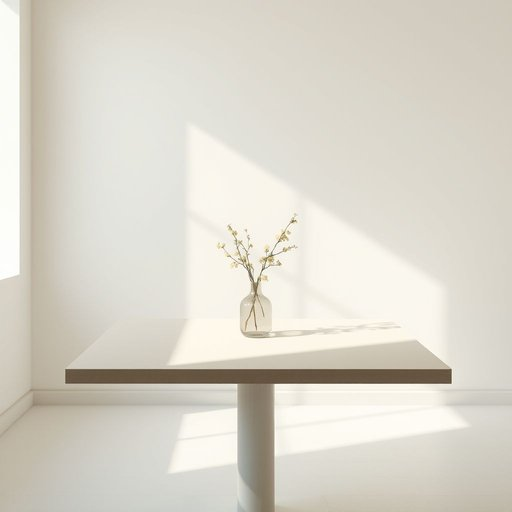

# flower

<h1 style="font-size: 2.5em; font-weight: 300; letter-spacing: 2px; margin: 0; color: #2c3e50;">
/flaʊər/
</h1>

---

---

## 例句

Could you please move the vase with the fresh flower by the window to the dining table, where it will catch the afternoon light better and brighten up the room during our family dinner?

*Could(/kʊd/) you(/ju/) please(/pliz/) move(/muv/) the(/ðə/) vase(/vɑz/) with(/wɪθ/) the(/ðə/) fresh(/frɛʃ/) flower(/flaʊər/) by(/baɪ/) the(/ðə/) window(/ˈwɪndoʊ/) to(/tɪ/) the(/ðə/) dining(/ˈdaɪnɪŋ/) table,(/ˈteɪbəl,/) where(/wɛr/) it(/ɪt/) will(/wɪl/) catch(/kæʧ/) the(/ðə/) afternoon(/ˌæftərˈnun/) light(/laɪt/) better(/ˈbɛtər/) and(/ənd/) brighten(/ˈbraɪtən/) up(/əp/) the(/ðə/) room(/rum/) during(/ˈdʊrɪŋ/) our(/ɑr/) family(/ˈfæməli/) dinner?(/ˈdɪnər?/)*

**翻译：** 请您把窗边那瓶插着鲜花的花瓶移到餐桌上吧，那儿下午的阳光照射得更好，能在我们家庭晚餐时为房间增添明亮与温馨。

---

## 解释

英语单词“flower”作为名词，在家居生活用品场景中通常指用于装饰或美化居室环境的植物开花部分，即花朵，具体使用时多见于描述鲜花（cut flowers）、花瓶中的花、盆栽开花植物或花卉装饰品。学习者在使用时需注意“flower”是可数名词，单数形式指一朵花，复数形式为“flowers”，且通常与量词搭配使用，如“a flower”，“some flowers”等；常见搭配包括“fresh flowers”（鲜花）、“artificial flowers”（人造花）、“flower arrangement”（插花）、“flower vase”（花瓶）等。此外，“flower”也可引申表示事物的精华或盛开状态，但在家居生活用品语境中，重点为实物花卉。该词源自古法语“flor”或“flour”，源自拉丁语“flos, floris”，意为“花”，反映了其重要的自然象征意义。在中文语境中，“flower”准确翻译为“花”或“花朵”，强调其植物学意义和装饰功能，无褒贬色彩，但因花在中国文化中常象征美好、祝福和吉祥，因此在家居环境中使用“flower”通常带有积极、温馨的文化涵义。

---

<small style="color: #999; font-size: 0.9em;">2025-07-17 06:22:39</small>

