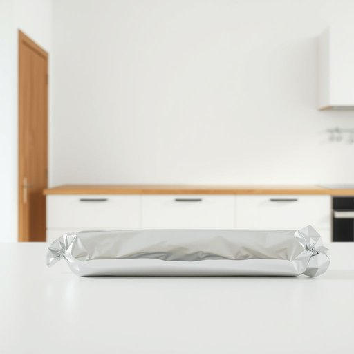

# foil

<h1 style="font-size: 2.5em; font-weight: 300; letter-spacing: 2px; margin: 0; color: #2c3e50;">
/fɔɪl/
</h1>

---

---

## 例句

Could you please grab the roll of foil from the kitchen drawer, the one we usually use to wrap leftovers or cover the baking tray, since I need to prepare the vegetables for roasting and want to ensure they retain their moisture without burning?

*Could(/kʊd/) you(/ju/) please(/pliz/) grab(/græb/) the(/ðə/) roll(/roʊl/) of(/əv/) foil(/fɔɪl/) from(/frəm/) the(/ðə/) kitchen(/ˈkɪʧən/) drawer,(/drɔr,/) the(/ðə/) one(/wən/) we(/wi/) usually(/ˈjuʒəwəli/) use(/juz/) to(/tɪ/) wrap(/ræp/) leftovers(/ˈlɛfˌtoʊvərz/) or(/ər/) cover(/ˈkəvər/) the(/ðə/) baking(/ˈbeɪkɪŋ/) tray,(/treɪ,/) since(/sɪns/) I(/aɪ/) need(/nid/) to(/tɪ/) prepare(/priˈpɛr/) the(/ðə/) vegetables(/ˈvɛʤtəbəlz/) for(/fər/) roasting(/ˈroʊstɪŋ/) and(/ənd/) want(/wɔnt/) to(/tɪ/) ensure(/ɪnˈʃʊr/) they(/ðeɪ/) retain(/rɪˈteɪn/) their(/ðɛr/) moisture(/ˈmɔɪsʧər/) without(/wɪˈθaʊt/) burning?(/ˈbərnɪŋ?/)*

**翻译：** 你能帮我从厨房抽屉里拿一下我们平时用来包剩菜或盖烤盘的那卷锡箔纸吗？我需要准备烤蔬菜，想确保它们在烘烤时保持水分，不会烤焦。

---

## 解释

英语单词“foil”在家居生活用品场景中作为名词，主要指厨房用的“锡箔”或“铝箔”，即常见的“foil”用来包裹食物以保鲜、烹饪时覆盖防止水分流失或加热均匀的金属薄膜。具体使用场合通常包括烤箱烹饪、食物储存和送餐包装，例如“aluminum foil”（铝箔）或“foil wrap”（锡纸包裹）。英语学习者使用该词时需要注意“foil”作为不可数名词时通常不加复数形式，且常与其他词搭配使用，如“roll of foil”（一卷锡箔）、“sheet of foil”（一张锡纸），此外“foil”可形容材料本身也可指包裹用具，表达时要根据上下文灵活判断。该词源自中古英语“foilen”，进一步来自中古法语“folie”，意指金属薄片，反映出其金属薄膜的属性。在中文语境中，“foil”准确翻译为“锡箔”或“铝箔”，体现其家用薄金属膜的功能性，常与烹饪相关；需要注意的是，“foil”在其他语境如文学中有“陪衬”或“挫败者”等含义，但在家居生活用品中无褒贬色彩，属中性词汇，强调其实用和保护食物的作用。

---

<small style="color: #999; font-size: 0.9em;">2025-07-17 06:22:39</small>

