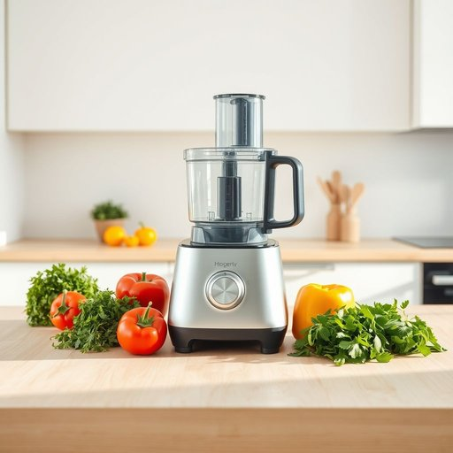

# food-processor

<h1 style="font-size: 2.5em; font-weight: 300; letter-spacing: 2px; margin: 0; color: #2c3e50;">
/food-processor*/
</h1>

---

---

## 例句

The researcher meticulously analyzed the intricate data sets, ensuring each variable was accounted for to construct a comprehensive model accurately predicting economic trends.

*The(/ðə/) researcher(/ˈrisərʧər/) meticulously(/məˈtɪkjələsli/) analyzed(/ˈænəˌlaɪzd/) the(/ðə/) intricate(/ˈɪntrəkət/) data(/ˈdætə/) sets,(/sɛts,/) ensuring(/ɪnˈʃʊrɪŋ/) each(/iʧ/) variable(/ˈvɛriəbəl/) was(/wɑz/) accounted(/əˈkaʊntɪd/) for(/fər/) to(/tɪ/) construct(/ˈkɑnstrəkt/) a(/ə/) comprehensive(/ˌkɑmpriˈhɛnsɪv/) model(/ˈmɑdəl/) accurately(/ˈækjərətli/) predicting(/prɪˈdɪktɪŋ/) economic(/ˌɛkəˈnɑmɪk/) trends.(/trɛnz./)*

**翻译：** 研究人员细致地分析了复杂的数据集，确保每一个变量都被考虑在内，从而构建出一个能够准确预测经济趋势的综合模型。

---

## 解释

“food-processor”作为名词，通常指家用电器中多功能的食品处理机，主要用于切碎、搅拌、和面、切片等烹饪准备工作，广泛应用于家庭厨房中以提高烹饪效率和便利性。它常出现在涉及厨房用具、烹饪技巧或食品制作的语境，比如食谱、购物指南、厨具介绍等。英语学习者使用该词时需注意，“food-processor”是复合名词，通常作为单数使用，复数形式为“food-processors”，且在句中多用作可数名词。此外，该词常与动词“use”、“operate”、“buy”等搭配，形容词“powerful”、“efficient”等用来修饰其性能，“kitchen”等词汇则与之组成固定词组。词源上，“food”意指食品，“processor”来源于动词process，意为处理，合成词强调了该设备对食品的机械化处理能力，这类合成词在现代英语中较为常见。中文语境中，“food-processor”准确翻译为“食品加工机”或“食物处理器”，更口语化和日常用语则常称为“多功能食物料理机”或简称“料理机”，其核心含义集中于“对食材进行机械加工”的功能，没有明显褒贬色彩或特殊文化内涵，显属中性词汇，主要体现现代厨房电器的发展和家庭生活便捷化的趋势。

---

<small style="color: #999; font-size: 0.9em;">2025-07-17 06:22:39</small>

