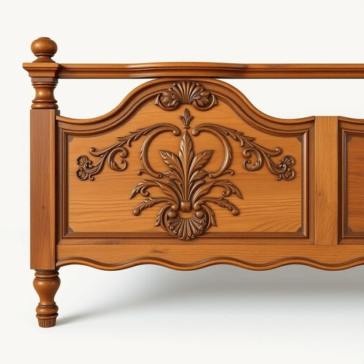

# footboard

<h1 style="font-size: 2.5em; font-weight: 300; letter-spacing: 2px; margin: 0; color: #2c3e50;">
/footboard*/
</h1>

---

---

## 例句

After carefully inspecting the antique bed frame we inherited, we realized that the intricate carvings on the footboard, which featured delicate floral motifs and a slightly curved top rail, would require professional restoration to preserve their original charm and prevent any further damage over time.

*After(/ˈæftər/) carefully(/ˈkɛrfəli/) inspecting(/ˌɪnˈspɛktɪŋ/) the(/ðə/) antique(/ænˈtik/) bed(/bɛd/) frame(/freɪm/) we(/wi/) inherited,(/ˌɪnˈhɛrətɪd,/) we(/wi/) realized(/ˈriəˌlaɪzd/) that(/ðət/) the(/ðə/) intricate(/ˈɪntrəkət/) carvings(/ˈkɑrvɪŋz/) on(/ɔn/) the(/ðə/) footboard,(/footboard*,/) which(/wɪʧ/) featured(/ˈfiʧərd/) delicate(/ˈdɛləkət/) floral(/ˈflɔrəl/) motifs(/moʊˈtifs/) and(/ənd/) a(/ə/) slightly(/sˈlaɪtli/) curved(/kərvd/) top(/tɔp/) rail,(/reɪl,/) would(/wʊd/) require(/ˌrikˈwaɪər/) professional(/prəˈfɛʃənəl/) restoration(/ˌrɛstərˈeɪʃən/) to(/tɪ/) preserve(/prɪˈzərv/) their(/ðɛr/) original(/ərˈɪʤənəl/) charm(/ʧɑrm/) and(/ənd/) prevent(/prɪˈvɛnt/) any(/ˈɛni/) further(/ˈfərðər/) damage(/ˈdæmɪʤ/) over(/ˈoʊvər/) time.(/taɪm./)*

**翻译：** 在仔细检查我们继承的古董床架后，我们意识到床尾板上那精美复杂的雕刻——以细腻的花卉图案和微微弯曲的顶梁为特色——需要专业修复，才能保持其原有的韵味，并防止随着时间推移产生进一步的损坏。

---

## 解释

英语单词“footboard”在家居生活用品的语境中作为名词，主要指床的脚板，即位于床尾部且通常较矮的一块板或框架部分，用于支撑床垫并有时起装饰作用，常见于传统或实木床架设计中。具体使用场合多见于描述卧室家具的布置、组装说明或购买家具时的描述，如“The footboard matches the headboard”（脚板和床头板相配）。英语学习者在使用“footboard”时应注意它通常作为可数名词出现，复数形式为“footboards”，并且不应与“footrest”或“footboard”在其他领域如交通工具中的含义混淆，如机动车脚踏板。常见搭配有“wooden footboard”（木制脚板）、“bed with a high footboard”（高脚板的床）等，表达时多用作名词，不带有特殊褒贬色彩，仅具功能性和装饰性的中性含义。词源上，“footboard”由“foot”（脚，底部）和“board”（板，木板）组合而成，字面指靠近脚部的板，起源于家具设计的结构描述。中文中，“footboard”准确翻译为“床脚板”或“床尾板”，强调其在床尾部、用于支撑和装饰的木质或其他材料制成的横板的功能和位置，便于理解和区分于床头板（headboard）。总的来说，“footboard”在家居语境中是一个中性且专业的家具术语，使用时注重语境对应和区分相关家具部件，避免混淆其在其他领域的含义。

---

<small style="color: #999; font-size: 0.9em;">2025-07-17 06:22:39</small>

