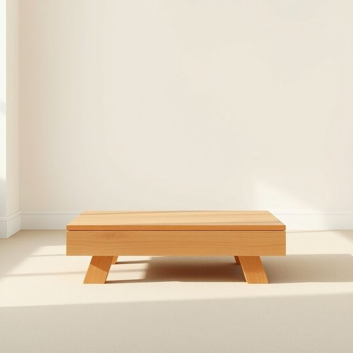

# footrest

<h1 style="font-size: 2.5em; font-weight: 300; letter-spacing: 2px; margin: 0; color: #2c3e50;">
/footrest*/
</h1>

---

---

## 例句

After hours of discussion, the proposal became the focal point of the meeting, illustrating how a single idea can shape the direction of an entire project.

*After(/ˈæftər/) hours(/aʊərz/) of(/əv/) discussion,(/dɪˈskəʃən,/) the(/ðə/) proposal(/prəˈpoʊzəl/) became(/bɪˈkeɪm/) the(/ðə/) focal(/ˈfoʊkəl/) point(/pɔɪnt/) of(/əv/) the(/ðə/) meeting,(/ˈmitɪŋ,/) illustrating(/ˈɪləˌstreɪtɪŋ/) how(/haʊ/) a(/ə/) single(/ˈsɪŋgəl/) idea(/aɪˈdiə/) can(/kən/) shape(/ʃeɪp/) the(/ðə/) direction(/dɪˈrɛkʃɪn/) of(/əv/) an(/ən/) entire(/ɪnˈtaɪər/) project.(/ˈprɑʤɛkt./)*

**翻译：** 经过数小时的讨论，该提案成为会议的焦点，充分展示了一个想法如何能够引领整个项目的方向。

---

## 解释

英语单词footrest作为名词，指的是家居生活中供人脚部休息或支撑的家具配件或装置，常见于椅子、沙发、躺椅等座椅的附属物，旨在提高坐姿的舒适度，减轻腿部疲劳。具体使用场合多见于客厅、书房或休息区，描述坐着时脚可以放置的位置或专门设计的脚凳。英语学习者在使用footrest时应注意其作为可数名词的形式，单数为footrest，复数为footrests，常见搭配包括adjustable footrest（可调节脚凳）、built-in footrest（内置脚踏）以及put one’s feet on the footrest（把脚放在脚踏上）等表达。此外，footrest通常与家具词汇如chair、sofa等一同出现，构成复合结构。词源方面，footrest由foot（脚）与rest（休息、支撑）合成，直观表明其功能属性，是英语中较为直白的合成词，无特殊隐喻或文化色彩，通常为中性词汇。在中文语境中，footrest准确翻译为脚踏、脚凳或脚托，强调其作为家具辅助部件的性质，宜根据具体款式选择合适译法，理解为帮助脚部放松和支撑的实用设施，无褒贬含义，文化上亦无特殊内涵，仅代表提升生活舒适度的常见家具用品。

---

<small style="color: #999; font-size: 0.9em;">2025-07-17 06:22:39</small>

