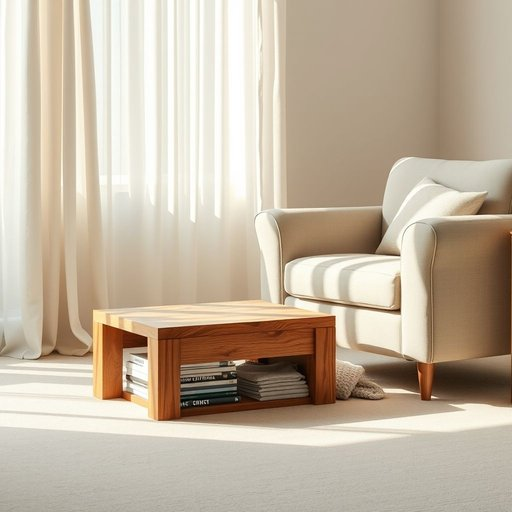

# footstool

<h1 style="font-size: 2.5em; font-weight: 300; letter-spacing: 2px; margin: 0; color: #2c3e50;">
/footstool*/
</h1>

---

---

## 例句

After a long day of work, my armchair offered the perfect refuge, its comfort rivaled only by the footstool beside it, which not only supported my tired feet but also cleverly concealed a collection of magazines and blankets for cozy evenings.

*After(/ˈæftər/) a(/ə/) long(/lɔŋ/) day(/deɪ/) of(/əv/) work,(/wərk,/) my(/maɪ/) armchair(/ˈɑrmˌʧɛr/) offered(/ˈɔfərd/) the(/ðə/) perfect(/ˈpərˌfɪkt/) refuge,(/ˈrɛfjuʤ,/) its(/ɪts/) comfort(/ˈkəmfərt/) rivaled(/ˈraɪvəld/) only(/ˈoʊnli/) by(/baɪ/) the(/ðə/) footstool(/footstool*/) beside(/ˌbiˈsaɪd/) it,(/ɪt,/) which(/wɪʧ/) not(/nɑt/) only(/ˈoʊnli/) supported(/səˈpɔrtɪd/) my(/maɪ/) tired(/taɪərd/) feet(/fit/) but(/bət/) also(/ˈɔlsoʊ/) cleverly(/ˈklɛvərli/) concealed(/kənˈsild/) a(/ə/) collection(/kəˈlɛkʃən/) of(/əv/) magazines(/ˈmægəˌzinz/) and(/ənd/) blankets(/ˈblæŋkəts/) for(/fər/) cozy(/ˈkoʊzi/) evenings.(/ˈivnɪŋz./)*

**翻译：** 经过一天的辛劳，扶手椅成了我完美的避风港，其舒适程度仅次于旁边的脚凳，而脚凳不仅托起了我疲惫的双脚，还巧妙地藏着一堆杂志和毯子，陪伴着温馨的夜晚。

---

## 解释

英语单词“footstool”作为名词，在家居生活用品的语境中指一种放置脚部的低凳或小凳子，通常用于坐椅或沙发前，帮助人们抬高双脚以增强舒适感，常见于客厅或书房等休闲环境。使用时，“footstool”通常用单数或复数形式出现，且常与动词“use”、“have”或介词短语“as a footstool”搭配，例如“She put her feet up on the footstool”或“The footstools were made of wood”。英语学习者需注意，“footstool”是可数名词，且构成为复合词，由“foot”（脚）和“stool”（凳子）组成，指专门为脚设计的小凳子，而非普通凳子，表达时避免混淆其用途和对象。词源方面，“footstool”起源于中古英语，最初用来指供人放脚的凳子或踏脚板，其构词直接反映了物品的功能和用途，没有特别隐喻或引申义。在中文语境中，“footstool”通常译作“脚凳”或“脚踏凳”，强调其提升脚部的功能，属于家居生活中的常见家具用品，无褒义或贬义，语义中性，文化内涵也是典型的西方家居舒适生活象征，体现了追求休闲和放松的生活方式。

---

<small style="color: #999; font-size: 0.9em;">2025-07-17 06:22:39</small>

