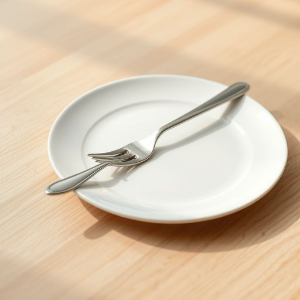

# fork

<h1 style="font-size: 2.5em; font-weight: 300; letter-spacing: 2px; margin: 0; color: #2c3e50;">
/fɔrk/
</h1>

---

---

## 例句

Although the concept of freedom can be elusive and varies dramatically across cultures, the philosopher argued that true freedom lies not in the absence of restrictions but in the presence of choice, responsibility, and the pursuit of meaningful goals.

*Although(/ˌɔlˈðoʊ/) the(/ðə/) concept(/ˈkɑnsɛpt/) of(/əv/) freedom(/ˈfridəm/) can(/kən/) be(/bi/) elusive(/ɪˈlusɪv/) and(/ənd/) varies(/ˈvɛriz/) dramatically(/drəˈmætɪkəli/) across(/əˈkrɔs/) cultures,(/ˈkəlʧərz,/) the(/ðə/) philosopher(/fəˈlɑsəfər/) argued(/ˈɑrgjud/) that(/ðət/) true(/tru/) freedom(/ˈfridəm/) lies(/laɪz/) not(/nɑt/) in(/ɪn/) the(/ðə/) absence(/ˈæbsəns/) of(/əv/) restrictions(/riˈstrɪkʃənz/) but(/bət/) in(/ɪn/) the(/ðə/) presence(/ˈprɛzəns/) of(/əv/) choice,(/ʧɔɪs,/) responsibility,(/riˌspɑnsəˈbɪləti,/) and(/ənd/) the(/ðə/) pursuit(/pərˈsut/) of(/əv/) meaningful(/ˈminɪŋfəl/) goals.(/goʊlz./)*

**翻译：** 尽管自由的概念往往难以捉摸，且在不同文化中差异显著，这位哲学家认为，真正的自由不在于没有限制，而在于拥有选择的权利、承担责任，以及追求有意义目标的过程。

---

## 解释

英语单词“fork”作为名词在家居生活用品场景中，主要指餐桌上用于进食的“叉子”，通常由金属制成，有一端为柄，另一端分叉成若干齿，用于叉取食物。具体使用时，常见于用餐环境描述，如“set the table with forks”（摆放餐叉），或在厨房工具介绍中。英语学习者需注意“fork”作为可数名词时，复数形式为“forks”，同时它常与其他餐具如“knife”（刀）、“spoon”（勺子）搭配，形成固定搭配如“fork and knife”。表达上，fork常用作具体物品，此外也有固定短语如“fork in the road”，但在家居语境中不常用。关于词源，“fork”源自拉丁语“furca”，意为“叉状物”，经中古法语进入英语，反映其分叉形态特征。在中文语境中，“fork”作为家居生活用品的准确翻译为“叉子”，这是最直接且广泛接受的对应词，没有褒贬色彩，但在文化层面，餐叉的使用反映了西方饮食文化和礼仪习惯，与筷子为代表的东方餐具形成对比。因此，理解“fork”的含义不仅是认知其物理形态，更涉及到对应文化习惯的匹配和使用场景的适当表达。

---

<small style="color: #999; font-size: 0.9em;">2025-07-17 06:22:39</small>

