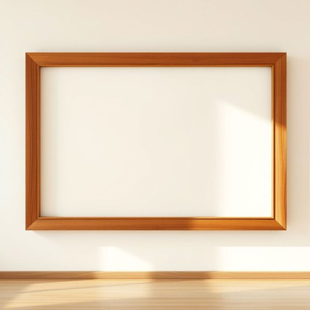

# frame

<h1 style="font-size: 2.5em; font-weight: 300; letter-spacing: 2px; margin: 0; color: #2c3e50;">
/freɪm/
</h1>

---

---

## 例句

Could you please help me hang this large photo frame on the living room wall, preferably above the fireplace where it will catch the light, because its ornate wooden frame, which was handcrafted by a local artisan, really complements the vintage décor we've been putting together over the past few months?

*Could(/kʊd/) you(/ju/) please(/pliz/) help(/hɛlp/) me(/mi/) hang(/hæŋ/) this(/ðɪs/) large(/lɑrʤ/) photo(/ˈfoʊˌtoʊ/) frame(/freɪm/) on(/ɔn/) the(/ðə/) living(/ˈlɪvɪŋ/) room(/rum/) wall,(/wɔl,/) preferably(/ˈprɛfərəbli/) above(/əˈbəv/) the(/ðə/) fireplace(/ˈfaɪərˌpleɪs/) where(/wɛr/) it(/ɪt/) will(/wɪl/) catch(/kæʧ/) the(/ðə/) light,(/laɪt,/) because(/bɪˈkəz/) its(/ɪts/) ornate(/ɔrˈneɪt/) wooden(/ˈwʊdən/) frame,(/freɪm,/) which(/wɪʧ/) was(/wɑz/) handcrafted(/ˈhændˌkræftɪd/) by(/baɪ/) a(/ə/) local(/ˈloʊkəl/) artisan,(/ˈɑrtəzən,/) really(/ˈrɪli/) complements(/ˈkɑmpləmənts/) the(/ðə/) vintage(/ˈvɪntɪʤ/) décor(/décor*/) we've(/wiv/) been(/bɪn/) putting(/ˈpʊtɪŋ/) together(/təˈgɛðər/) over(/ˈoʊvər/) the(/ðə/) past(/pæst/) few(/fju/) months?(/mənθs?/)*

**翻译：** 你能帮我把这幅大照片框挂在客厅的墙上吗？最好挂在壁炉上方，这样它能沐浴光线。这款由本地工匠手工制作的精致木框，非常契合我们过去几个月精心布置的复古风格。

---

## 解释

英语单词“frame”作为名词在家居生活用品的语境中，通常指用来固定或支撑物体的框架或结构，如照片框、镜框、家具框架等，常见于描述家居装饰、陈设和结构物件时，使用时需注意“frame”多用于具体物体的外部或内部骨架，搭配时常见的表达有“wooden frame”（木质框架）、“metal frame”（金属框架）、“frame size”（框架尺寸）等，且“frame”作为可数名词时要注意单复数变化“a frame”与“frames”，学习者还应关注其与动词用法的区别，名词侧重实体的框架，而作为动词时含“构架、陷害”等意思，使用时切勿混淆，词源方面，“frame”起源于中古英语，来源于古法语“frame”或“framer”，本意为“制作框架”，与构造和成型相关，体现了其坚固和支持的含义，在中文语境中，“frame”最准确的翻译为“框架”或“框”，强调的是用来支撑、包围或限定物体形态的结构，通常无贬义，属于中性词汇，文化上不具特殊褒贬色彩，但在家居设计中体现了物品的风格与质感，是描述空间布局和装饰细节的重要词汇，因此，理解“frame”不仅要求掌握其物理结构意义，还要结合具体语境理解其在家居生活中表现出的功能与美学价值。

---

<small style="color: #999; font-size: 0.9em;">2025-07-17 06:22:39</small>

