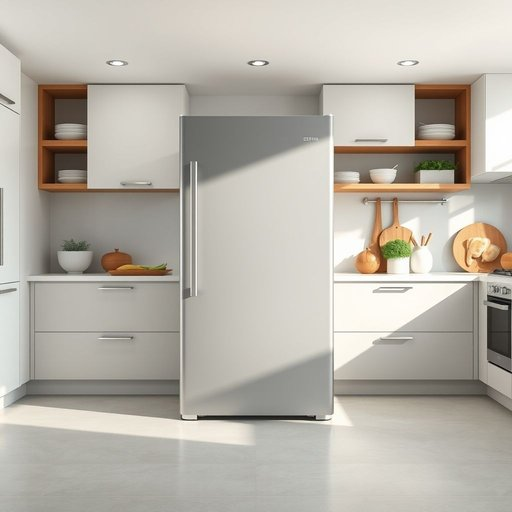

# freezer

<h1 style="font-size: 2.5em; font-weight: 300; letter-spacing: 2px; margin: 0; color: #2c3e50;">
/ˈfrizər/
</h1>

---

---

## 例句

Before we start preparing tonight’s dinner, could you please check the freezer to see if we still have enough frozen peas and chicken breasts left, as I want to avoid making an extra trip to the shop after such a long day?

*Before(/ˌbiˈfɔr/) we(/wi/) start(/stɑrt/) preparing(/pərˈpɛrɪŋ/) tonight’s(/tonight’s*/) dinner,(/ˈdɪnər,/) could(/kʊd/) you(/ju/) please(/pliz/) check(/ʧɛk/) the(/ðə/) freezer(/ˈfrizər/) to(/tɪ/) see(/si/) if(/ɪf/) we(/wi/) still(/stɪl/) have(/hæv/) enough(/ɪˈnəf/) frozen(/ˈfroʊzən/) peas(/piz/) and(/ənd/) chicken(/ˈʧɪkən/) breasts(/brɛsts/) left,(/lɛft,/) as(/ɛz/) I(/aɪ/) want(/wɔnt/) to(/tɪ/) avoid(/əˈvɔɪd/) making(/ˈmeɪkɪŋ/) an(/ən/) extra(/ˈɛkstrə/) trip(/trɪp/) to(/tɪ/) the(/ðə/) shop(/ʃɑp/) after(/ˈæftər/) such(/səʧ/) a(/ə/) long(/lɔŋ/) day?(/deɪ?/)*

**翻译：** 在我们开始准备今晚的晚餐之前，能否请你先检查一下冰箱冷冻室，看我们是否还有足够的冷冻豌豆和鸡胸肉？我想避免在经历了这么漫长的一天后，再额外跑一趟商店。

---

## 解释

英语单词"freezer"作为名词，在家居生活用品场景中指的是一种用于冷冻食物以延长保存时间的电器设备，通常是冰箱的一部分或独立的冷藏柜，常见于家庭厨房或食品储藏室。"freezer"常见的使用场合包括购买食材后将其冷冻保存、制作冷冻食品或储存剩饭剩菜等，其语境一般与食品保鲜和家用电器相关。学习者需注意"freezer"是可数名词，表示具体的设备，因此常与冠词连用，如"a freezer"或"the freezer"，且常见搭配有"chest freezer"（臥式冷柜）、"freezer compartment"（冷冻室）、"freezer bag"（冷冻袋）等，表达时可结合形容词如"deep freezer"（深冷柜）增强描述。此外，"freezer"与动词"freeze"相关，词尾"-er"表明其为执行动作的物体，这一构词法在英语中较为常见。词源上，"freezer"来源于动词"freeze"，源自古英语"frēosan"，意为“冻结”，后加"-er"构成名词表示“使冷冻的装置”。在中文语境中，"freezer"最准确的翻译为“冰箱的冷冻室”或“冷冻柜”，通常根据具体形态翻译为“冰柜”、“冷冻柜”或“冷冻室”，区别于冰箱的冷藏室，强调低温冷冻功能。该词本身无明显褒贬色彩，但在不同文化背景下，人们对冷冻食品的接受度和使用频率可能有所差异，因此使用时应结合具体生活习惯理解。总体而言，“freezer”是家居生活中不可或缺的实用名词，体现了现代储存技术对食品保鲜的便利作用。

---

<small style="color: #999; font-size: 0.9em;">2025-07-17 06:22:39</small>

