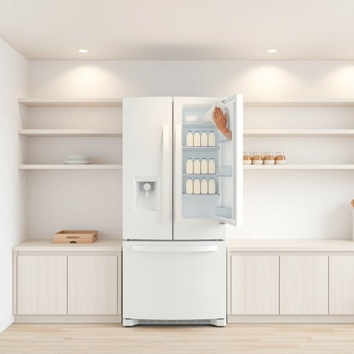

# fridge

<h1 style="font-size: 2.5em; font-weight: 300; letter-spacing: 2px; margin: 0; color: #2c3e50;">
/frɪʤ/
</h1>

---

---

## 例句

Could you please check the fridge to see if we still have any milk left, and while you’re at it, make sure to wipe down the shelves because last week’s spill hasn’t been cleaned properly, which might cause an unpleasant smell to develop over time?

*Could(/kʊd/) you(/ju/) please(/pliz/) check(/ʧɛk/) the(/ðə/) fridge(/frɪʤ/) to(/tɪ/) see(/si/) if(/ɪf/) we(/wi/) still(/stɪl/) have(/hæv/) any(/ˈɛni/) milk(/mɪlk/) left,(/lɛft,/) and(/ənd/) while(/waɪl/) you’re(/you’re*/) at(/æt/) it,(/ɪt,/) make(/meɪk/) sure(/ʃʊr/) to(/tɪ/) wipe(/waɪp/) down(/daʊn/) the(/ðə/) shelves(/ʃɛlvz/) because(/bɪˈkəz/) last(/læst/) week’s(/week’s*/) spill(/spɪl/) hasn’t(/hasn’t*/) been(/bɪn/) cleaned(/klind/) properly,(/ˈprɑpərli,/) which(/wɪʧ/) might(/maɪt/) cause(/kɔz/) an(/ən/) unpleasant(/ənˈplɛzənt/) smell(/smɛl/) to(/tɪ/) develop(/dɪˈvɛləp/) over(/ˈoʊvər/) time?(/taɪm?/)*

**翻译：** 你能帮忙检查一下冰箱里是否还有牛奶吗？顺便把货架擦一擦，上周的洒漏没清理干净，时间长了可能会发出异味。

---

## 解释

英语单词“fridge”作为名词在家居生活用品的语境中指的是“冰箱”，即用于储存食物和饮料以保持其新鲜的电器设备。具体使用场合通常是在家庭厨房、办公室茶水间或任何需要冷藏食材的地方。英语学习者在使用“fridge”时需注意它是“refrigerator”的非正式缩写，适合口语和日常书写，但在正式文档中宜用完整形式“refrigerator”。语法上，作为可数名词，“fridge”可用单数或复数形式（fridges），例如“a new fridge”或“two fridges”。常见搭配有“open the fridge”（打开冰箱）、“fridge door”（冰箱门）、“fridge magnet”（冰箱贴）等，表达生活中的细节或习惯时十分常见。词源方面，“fridge”源自单词“refrigerator”的缩略形式，最早出现于20世纪中期，体现简化口语的趋势。中文语境中，“fridge”准确翻译为“冰箱”，概念清晰且无负面含义，属于中性词汇，文化内涵主要关联于现代家庭生活的便利设备，无特殊褒贬色彩，普遍为生活中不可或缺的家电之一。

---

<small style="color: #999; font-size: 0.9em;">2025-07-17 06:22:39</small>

