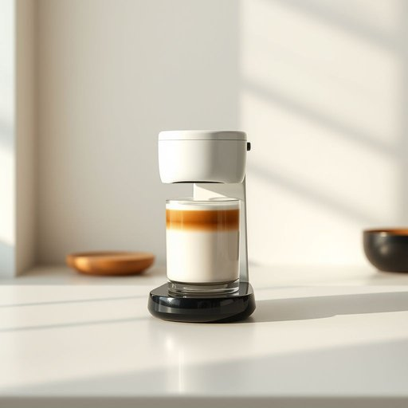

# frother

<h1 style="font-size: 2.5em; font-weight: 300; letter-spacing: 2px; margin: 0; color: #2c3e50;">
/frother*/
</h1>

---

---

## 例句

While I was rummaging through the kitchen drawer, which was cluttered with mismatched lids and old tea towels, I tried to find the frother that my partner insists we need for making those fancy cappuccinos with perfectly textured milk, even though we rarely use it.

*While(/waɪl/) I(/aɪ/) was(/wɑz/) rummaging(/ˈrəmɪʤɪŋ/) through(/θru/) the(/ðə/) kitchen(/ˈkɪʧən/) drawer,(/drɔr,/) which(/wɪʧ/) was(/wɑz/) cluttered(/ˈklətərd/) with(/wɪθ/) mismatched(/mɪsˈmæʧt/) lids(/lɪdz/) and(/ənd/) old(/oʊld/) tea(/ti/) towels,(/taʊəlz,/) I(/aɪ/) tried(/traɪd/) to(/tɪ/) find(/faɪnd/) the(/ðə/) frother(/frother*/) that(/ðət/) my(/maɪ/) partner(/ˈpɑrtnər/) insists(/ˌɪnˈsɪsts/) we(/wi/) need(/nid/) for(/fər/) making(/ˈmeɪkɪŋ/) those(/ðoʊz/) fancy(/ˈfænsi/) cappuccinos(/cappuccinos*/) with(/wɪθ/) perfectly(/ˈpərfəktli/) textured(/ˈtɛksʧərd/) milk,(/mɪlk,/) even(/ˈivɪn/) though(/ðoʊ/) we(/wi/) rarely(/ˈrɛrli/) use(/juz/) it.(/ɪt./)*

**翻译：** 当我翻找那只堆满了参差不齐盖子和旧茶巾的厨房抽屉时，试图找到我伴侣坚称我们需要的奶泡器，用来制作那些奶质细腻、造型讲究的卡布奇诺，尽管我们很少使用它。

---

## 解释

“frother”作为名词在家居生活用品的语境中，通常指用于制造泡沫的工具或设备，最常见的是咖啡奶泡器，即用来打发牛奶产生细腻泡沫以制作拿铁、卡布奇诺等咖啡饮品的器具。使用场合多见于厨房、咖啡制作或相关家电产品介绍中，如“milk frother”（奶泡机）。英语学习者需要注意frother作名词时的语法使用，通常作为可数名词使用，可与不定冠词a/an连用，如a frother，且常与milk搭配形成复合名词milk frother。此外，frother还可用作动词，意为“制造泡沫”，但在家居用品语境多指名词用法。frother源自动词froth，意指产生泡沫，词根与中世纪晚期英语froth“泡沫”相关，说明该词本质上与泡沫产生紧密相连。在中文语境下，frother常准确翻译为“奶泡器”或“奶泡机”，强调其功能属性，即用于搅打牛奶表面形成泡沫的工具，翻译时应避免直接音译成“弗罗瑟”之类，保持其功能语义。此词本身中性无褒贬或特殊文化内涵，仅作为具体生活用品名词使用。总之，frother在家居生活用品中指的是制造泡沫尤其是打奶泡的机械或手持工具，学习时应结合具体搭配和语境理解其准确含义。

---

<small style="color: #999; font-size: 0.9em;">2025-07-17 06:22:39</small>

