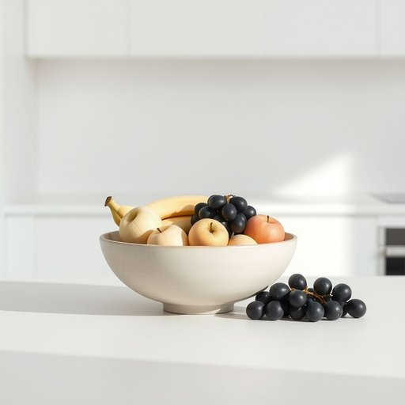

# fruit-bowl

<h1 style="font-size: 2.5em; font-weight: 300; letter-spacing: 2px; margin: 0; color: #2c3e50;">
/fruit-bowl*/
</h1>

---

---

## 例句

Although the kitchen counter was cluttered with various appliances and cookbooks, the elegant ceramic fruit-bowl, filled to the brim with ripe apples, bananas, and a handful of glossy grapes, remained the centerpiece, adding a vibrant splash of colour to the otherwise neutral-toned room.

*Although(/ˌɔlˈðoʊ/) the(/ðə/) kitchen(/ˈkɪʧən/) counter(/ˈkaʊntər/) was(/wɑz/) cluttered(/ˈklətərd/) with(/wɪθ/) various(/ˈvɛriəs/) appliances(/əˈplaɪənsɪz/) and(/ənd/) cookbooks,(/ˈkʊkˌbʊks,/) the(/ðə/) elegant(/ˈɛləgənt/) ceramic(/sərˈæmɪk/) fruit-bowl,(/fruit-bowl*,/) filled(/fɪld/) to(/tɪ/) the(/ðə/) brim(/brɪm/) with(/wɪθ/) ripe(/raɪp/) apples,(/ˈæpəlz,/) bananas,(/bəˈnænəz,/) and(/ənd/) a(/ə/) handful(/ˈhændˌfʊl/) of(/əv/) glossy(/ˈglɔsi/) grapes,(/greɪps,/) remained(/rɪˈmeɪnd/) the(/ðə/) centerpiece,(/ˈsɛntərˌpis,/) adding(/ˈædɪŋ/) a(/ə/) vibrant(/ˈvaɪbrənt/) splash(/splæʃ/) of(/əv/) colour(/ˈkələr/) to(/tɪ/) the(/ðə/) otherwise(/ˈəðərˌwaɪz/) neutral-toned(/neutral-toned*/) room.(/rum./)*

**翻译：** 尽管厨房台面上摆满了各种电器和烹饪书，那只装满了熟透苹果、香蕉和一把晶莹葡萄的精致陶瓷果盘依旧成为了视觉焦点，为这间整体色调素雅的房间增添了一抹鲜艳的色彩。

---

## 解释

fruit-bowl作为名词主要指用于盛放水果的碗或容器，通常出现在家居厨房、餐厅或餐桌等场合，既具有实用功能也常作为装饰品。英语学习者在使用该词时需注意其复合词结构，通常由fruit（水 果）和bowl（碗）组成，且多为单数形式，若表示多个则用复数fruit bowls，表达时常搭配动词如put、place、fill等，如a glass fruit bowl（玻璃水果碗）、an empty fruit bowl（空水果碗）是常见的固定用法。语法上，作为名词，fruit-bowl在句中可做主语、宾语、定语等位置，且有时可加限定词或形容词修饰。词源上，该词源于英文对家居用品的直白命名方式，即将盛放物品的种类fruit与盛放器具bowl合成，体现了英语复合词的构词特点，起源背景没有特殊文化含义，属于日常生活用语。在中文语境中，准确翻译为水果碗或水果盆，强调的是用于装水果的容器，语义明确，无褒贬色彩或特殊文化内涵，更多体现实用和装饰双重属性，是家居生活中常见的物件，便于理解和使用。

---

<small style="color: #999; font-size: 0.9em;">2025-07-17 06:22:39</small>

