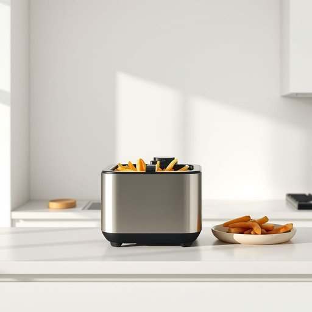

# fryer

<h1 style="font-size: 2.5em; font-weight: 300; letter-spacing: 2px; margin: 0; color: #2c3e50;">
/fraɪər/
</h1>

---

---

## 例句

After struggling to get dinner ready in time, I realized that the fryer, which I had bought last year for quick meals but rarely used, was actually perfect for cooking crispy chips and reheating leftovers without drying them out.

*After(/ˈæftər/) struggling(/ˈstrəgəlɪŋ/) to(/tɪ/) get(/gɪt/) dinner(/ˈdɪnər/) ready(/ˈrɛdi/) in(/ɪn/) time,(/taɪm,/) I(/aɪ/) realized(/ˈriəˌlaɪzd/) that(/ðət/) the(/ðə/) fryer,(/fraɪər,/) which(/wɪʧ/) I(/aɪ/) had(/hæd/) bought(/bɔt/) last(/læst/) year(/jɪr/) for(/fər/) quick(/kwɪk/) meals(/milz/) but(/bət/) rarely(/ˈrɛrli/) used,(/juzd,/) was(/wɑz/) actually(/ˈæˌkʧuəli/) perfect(/ˈpərˌfɪkt/) for(/fər/) cooking(/ˈkʊkɪŋ/) crispy(/ˈkrɪspi/) chips(/ʧɪps/) and(/ənd/) reheating(/reheating*/) leftovers(/ˈlɛfˌtoʊvərz/) without(/wɪˈθaʊt/) drying(/draɪɪŋ/) them(/ðɛm/) out.(/aʊt./)*

**翻译：** 在为准备晚餐忙得焦头烂额时，我意识到那台去年买来用以快速做饭但很少使用的空气炸锅，实际上非常适合做出酥脆的炸薯条，还能加热剩菜而不会把它们弄干。

---

## 解释

英语单词“fryer”在家居生活用品的场景中作为名词通常指“油炸锅”或“炸锅”即用于油炸食物的厨房电器或器具常见于家庭厨房和餐厅具体使用场合多为烹饪过程中如“electric fryer”“deep fryer”等表达强调利用热油进行食物炸制英语学习者在使用“fryer”时应注意其名词性质通常可作可数名词如a fryer或the fryer且常与形容词或限定词搭配如“small fryer”“portable fryer”语法结构较为简单此外“fryer”还可指用来炸制的食物容器但与“fry”动词区别明确不易混淆词源上“fryer”源自动词“fry”的现在分词及名词化形式最早见于16世纪意为用于油炸的器具或负责油炸的人历经演变专指油炸锅具中文语境中“fryer”准确翻译为“炸锅”或“油炸锅”含义明确实用性强无褒贬色彩属于中性词汇文化内涵主要体现在西方饮食习惯中普遍使用油炸工具的生活方式使用时应避免与表达人称的“fryer”（即炸食物的人）混淆尤其在非烹饪背景下的语义拓展整体上“fryer”在家居生活用品领域中指家用或商用的油炸设备表达明确且常见

---

<small style="color: #999; font-size: 0.9em;">2025-07-17 06:22:39</small>

