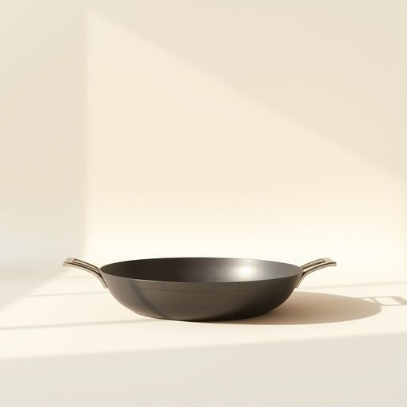

# frying-pan

<h1 style="font-size: 2.5em; font-weight: 300; letter-spacing: 2px; margin: 0; color: #2c3e50;">
/frying-pan*/
</h1>

---

---

## 例句

While the painting skill demonstrated in the artwork was impressive, it was the profound meaning conveyed through the use of color and composition that truly elevated the art to a masterpiece.

*While(/waɪl/) the(/ðə/) painting(/ˈpeɪnɪŋ/) skill(/skɪl/) demonstrated(/ˈdɛmənˌstreɪtɪd/) in(/ɪn/) the(/ðə/) artwork(/ˈɑrtˌwərk/) was(/wɑz/) impressive,(/ˌɪmˈprɛsɪv,/) it(/ɪt/) was(/wɑz/) the(/ðə/) profound(/proʊˈfaʊnd/) meaning(/ˈminɪŋ/) conveyed(/kənˈveɪd/) through(/θru/) the(/ðə/) use(/juz/) of(/əv/) color(/ˈkələr/) and(/ənd/) composition(/ˌkɑmpəˈzɪʃən/) that(/ðət/) truly(/ˈtruli/) elevated(/ˈɛləˌveɪtɪd/) the(/ðə/) art(/ɑrt/) to(/tɪ/) a(/ə/) masterpiece.(/ˈmæstərˌpis./)*

**翻译：** 虽然这幅作品展现出的绘画技巧令人印象深刻，但正是通过色彩和构图传递的深刻意蕴，真正将其提升为一件艺术瑰宝。

---

## 解释

“frying-pan”作为名词，指的是一种用于煎炒食物的平底锅，通常由金属如铁、不锈钢或铝制成，底部平坦，边缘较低，适合家居厨房中煎蛋、炒菜等烹饪操作。具体使用场合多为家庭厨房、餐厅或烹饪教学中，语境通常涉及烹饪动作、烹饪工具描述或厨房用具采购。英语学习者在使用“frying-pan”时需要注意其拼写为复合名词，通常连写或用连字符连接，且多作为单数或复数形式“frying-pans”出现，语法上与普通可数名词相同，可用冠词，如a frying-pan或the frying-pan。常见搭配包括动词如“use a frying-pan”，“heat the frying-pan”，形容词如“non-stick frying-pan”（不粘锅），名词搭配“frying-pan handle”（锅柄）等。词源方面，“frying”来源于动词“fry”（煎、炸），加上名词“pan”（盘、锅）组成复合词，历史悠久，反映了此工具专用于“煎炸”的功能。中文语境中，“frying-pan”准确翻译为“煎锅”或“平底锅”，强调其在烹饪中用于煎炒的用途，属于家居生活中的常见厨房用具。该词无特殊褒贬含义，多为中性表达；在英语文化中亦无特殊隐喻或文化内涵，仅为描述工具的通用名词。总体而言，掌握“frying-pan”的使用及其常见搭配，有助于正确表达和理解与烹饪相关的日常会话和写作。

---

<small style="color: #999; font-size: 0.9em;">2025-07-17 06:22:39</small>

